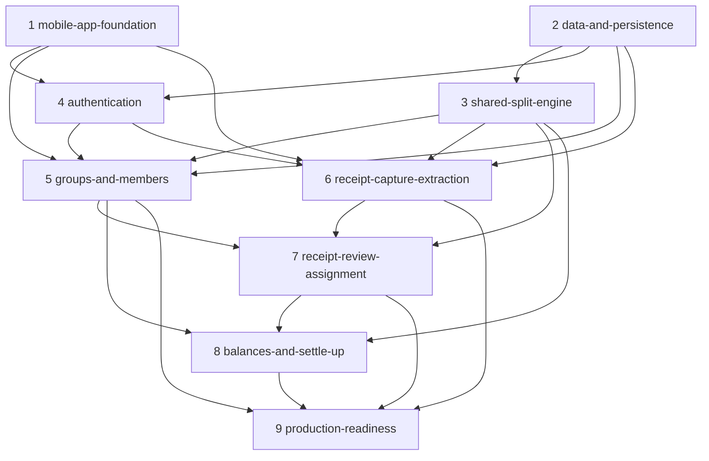

# Divvy Up — Spec Index

Spec-driven development, Kiro style. Read `.kiro/steering/` first — every spec inherits that
shared context. Each feature below is **one shippable PR**, with tasks ordered
**frontend-first, then backend, then wire-up** (see `steering/tech.md`).

## Features & PR sequence

Order respects dependencies. Foundations (1–4) unlock the vertical features (5–8); hardening
(9) lands last.

| #   | Spec                         | Type          | Delivers (one PR)                                                                                                                          | Depends on |
| --- | ---------------------------- | ------------- | ------------------------------------------------------------------------------------------------------------------------------------------ | ---------- |
| 1   | `mobile-app-foundation`      | FE foundation | Expo + expo-router shell, Tamagui theme from design tokens, ported component kit, API client adapter, remove `packages/web`                | —          |
| 2   | `data-and-persistence`       | BE foundation | `packages/db` (Drizzle + Postgres/Supabase), full schema + migrations, repositories rewritten off stubs                                    | —          |
| 3   | `shared-split-engine`        | Shared        | `packages/split-engine` — pence-exact `splitPence`/`computeSplit`, pro-rata adjustments, integer weights; replaces `computeBalances`       | 2 (types)  |
| 4   | `authentication`             | FE + BE       | Onboarding/login/signup screens, Supabase session on device, JWKS verification middleware + API authorizer, user-scoped queries            | 1, 2       |
| 5   | `groups-and-members`         | FE → BE       | Home group cards, create/manage group, members incl. accountless placeholders, invite, people-colour system                                | 1–4        |
| 6   | `receipt-capture-extraction` | FE → BE       | Camera/scan/import, S3 upload, AI-processing screen, real vision/OCR extraction → items + confidence                                       | 1–4        |
| 7   | `receipt-review-assignment`  | FE → BE       | Review & assign screen, item-editor sheet, 4 assignment modes, confidence "quick check", adjustments, "how AI read your receipt", finalize | 3, 5, 6    |
| 8   | `balances-and-settle-up`     | FE → BE       | Balances (who owes whom), settle-up / mark-as-paid, activity feed                                                                          | 3, 5, 7    |
| 9   | `production-readiness`       | BE / ops      | Error handler, coverage gates, custom domains, preprod stage, secrets, monitoring, EAS build/submit, store-submission prep                 | 1–8        |

## Dependency graph

## How to use these specs

1. Pick the next spec in sequence. Read its `requirements.md` → `design.md` → `tasks.md`.
2. Implement `tasks.md` top to bottom (frontend-first). Check off tasks as you go.
3. Open one PR for the feature. It's done per the "Delivery model" gate in `steering/tech.md`.
4. Specs are living documents — update them if the design changes during implementation.

## Status

All nine specs are authored (requirements + design + tasks). Implementation has not started.
