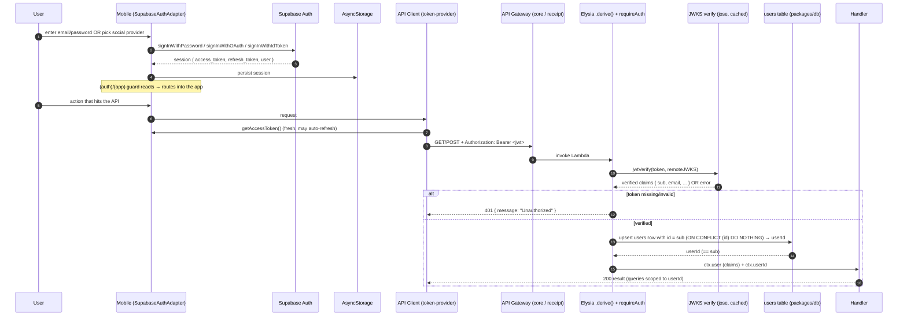

# Design — Authentication

> Inherits `.kiro/steering/`. Implements `requirements.md` for feature #4. Patterns mirror the
> reference app `persistence-backend-sst`
> (`packages/api-utils/src/auth/supabaseAuth.ts`, `packages/mobile/src/adapters/auth/`).

## Overview

Authentication has two halves joined by a single bearer token:

- **Mobile (FE):** the Supabase JS client lives behind an `AuthPort` adapter
  (`SupabaseAuthAdapter`). It persists the session in AsyncStorage, auto-refreshes, re-checks on
  `AppState` foreground, and serializes with `processLock`. An auth context exposes session
  state to the **expo-router `(auth)` / `(app)` guard**, and the foundation's API client
  token-provider pulls the current access token from the adapter on every request.
- **Backend (BE):** an `api-utils` auth module verifies the Supabase JWT against Supabase's
  **JWKS** with `jose` (cached per warm Lambda). An Elysia `.derive()` attaches a verified
  `user` to context, `requireAuth` returns `401` when absent, and a provisioning step maps the
  Supabase `sub` to a Divvy Up `users` row so handlers receive an internal `userId`. The
  middleware is applied to **both** API gateways.

Supabase is the identity provider only. All business data is served by the SST/Elysia API.

## Architecture



## Components & Interfaces

### Mobile

**`AuthPort`** — `packages/mobile/src/domain/ports/auth.port.ts` (ported from reference). The
contract the UI codes against; lets screens be built against a mock before the real adapter
exists.

```ts
export type OAuthProvider = "google" | "apple" | "facebook";

export type AuthSession = {
  accessToken: string;
  refreshToken: string;
  userId: string; // Supabase user id (sub)
  email: string;
  expiresAt: number;
};

export interface AuthPort {
  signInWithEmail(
    email: string,
    password: string,
  ): Promise<Result<AuthSession, AuthError>>;
  signUpWithEmail(
    email: string,
    password: string,
  ): Promise<Result<AuthSession, AuthError>>;
  signInWithOAuth(
    provider: OAuthProvider,
  ): Promise<Result<AuthSession, AuthError>>;
  signInWithApple(): Promise<Result<AuthSession, AuthError>>; // native iOS
  signOut(): Promise<Result<void, AuthError>>;
  getSession(): Promise<Result<AuthSession | null, AuthError>>;
  onAuthStateChange(cb: (session: AuthSession | null) => void): () => void;
  resetPassword(email: string): Promise<Result<void, AuthError>>;
  refreshSession(): Promise<Result<AuthSession, AuthError>>;
  getAccessToken(): Promise<string | null>;
}
```

- **`SupabaseAuthAdapter implements AuthPort`** — `packages/mobile/src/adapters/auth/supabase.adapter.ts`.
  Wraps `createClient(url, anonKey, { auth: { storage: AsyncStorage, autoRefreshToken: true,
persistSession: true, detectSessionInUrl: false, lock: processLock } })`. Adds an
  `AppState` listener that calls `startAutoRefresh()` on `active` and `stopAutoRefresh()`
  otherwise; `destroy()` removes it. OAuth (Google/Facebook) uses
  `signInWithOAuth({ skipBrowserRedirect: true })` + `WebBrowser.openAuthSessionAsync` with a
  `Linking.createURL("auth/callback")` redirect and a per-provider account-picker query param
  (`prompt=select_account` / `auth_type=reauthenticate`); Apple uses
  `expo-apple-authentication` → `signInWithIdToken`. Returns `Result<…, AuthError>` with codes
  `invalid_credentials | email_taken | email_confirmation_required | token_expired | cancelled |
unknown`.
- **`MockAuthAdapter implements AuthPort`** — `packages/mobile/src/adapters/auth/mock.adapter.ts`.
  In-memory; drives the FE-first build and Jest tests before the real client is wired.
- **Auth context / `useAuth`** — `packages/mobile/src/features/auth/AuthContext.tsx`. Holds
  `{ session, status: "loading" | "authenticated" | "unauthenticated" }`, restores the session
  on mount via `getSession`, subscribes via `onAuthStateChange`, and exposes the action methods.
- **Screens** (this spec designs them; live under `packages/mobile/app/(auth)/` +
  `features/auth/`):
  - `OnboardingScreen` — value prop + "Get started" / "I already have an account".
  - `SignUpScreen` — email/password fields, validation, social buttons, "check your email" state.
  - `LoginScreen` — email/password, "Forgot password", social buttons, error banner.
  - `SocialButtons` — Google / Apple (iOS native) / Facebook, shared by both screens.
- **Router guard** — `packages/mobile/app/_layout.tsx` reads `useAuth().status` and uses
  expo-router `Redirect` / segment checks to keep unauthenticated users in `(auth)` and
  authenticated users in `(app)`; shows a splash while `status === "loading"`.

### Backend — `packages/api-utils/src/auth/`

New module `supabaseAuth.ts` (sibling to the existing decode-only `jwt/`; the `jwt/` helpers are
**not** used for trust decisions):

```ts
export type SupabaseUser = {
  sub: string;
  email: string;
  email_verified: boolean;
  iat: number;
  exp: number;
};

// JWKS cached per warm Lambda
let _jwks: ReturnType<typeof createRemoteJWKSet> | null = null;
function getJwks() {
  /* build from SUPABASE_URL/auth/v1/.well-known/jwks.json, memoize */
}

// getAuthUser MUST verify claims, not just the signature:
//   jwtVerify(token, getJwks(), {
//     issuer: `${SUPABASE_URL}/auth/v1`,   // reject tokens from another project
//     audience: "authenticated",            // reject non-authenticated/service tokens
//   })
// Signature + `exp` alone are insufficient — `aud`/`iss` must be asserted.

// Returns verified claims, or null on missing/invalid token.
export async function getAuthUser(
  authHeader: string | undefined,
): Promise<SupabaseUser | null>;

// onBeforeHandle hook — returns { message: "Unauthorized" } + set.status 401 when no user.
export function requireAuth(ctx: {
  user: SupabaseUser | null;
  set: { status: number };
}): unknown;

// Typed reader after requireAuth has guaranteed presence.
export function getUser(ctx: { user: SupabaseUser | null }): SupabaseUser;
```

- **User provisioning** — `packages/api-utils/src/auth/provisionUser.ts`:
  `provisionUser(claims: SupabaseUser): Promise<{ userId: string }>` upserts into `packages/db`
  `users` using `claims.sub` as the primary-key `id` (Divvy Up `users.id` **is** the Supabase
  user id — see `data-and-persistence`). `displayName` is derived from `email` (or
  `user_metadata.name` when present) since base claims carry no name. Returns `claims.sub` as the
  `userId`. Idempotent.
- **Wiring helper** — exported `withAuth(app: Elysia)` (or applied inline) that does
  `.derive(async ({ headers }) => { const user = await getAuthUser(headers.authorization);
const userId = user ? (await provisionUser(user)).userId : null; return { user, userId }; })`
  `.onBeforeHandle(requireAuth)`. Applied in both `microservices/core/src/api.ts` and
  `microservices/other-service/src/api.ts` so handlers read `ctx.userId`.

### Infra — `infra/api.ts`

JWT verification is done **in-app** (Elysia middleware), not via an API Gateway JWT authorizer,
so verified claims and the provisioned `userId` flow through one code path shared by both
services. `infra/api.ts` is updated to **link `SUPABASE_URL` (and the secret needed for JWKS
fetch) to both `coreAPI` and `receiptServiceAPI`** routes, replacing the
`// TODO: add JWT authorizer` comment. `SUPABASE_URL` is provided via `sst.Secret` /
environment per `steering/tech.md` (secrets never in git).

## Data Models

**Verified JWT claims (`SupabaseUser`)** — the trusted shape after `jwtVerify`:

| Field            | Type      | Notes                                       |
| ---------------- | --------- | ------------------------------------------- |
| `sub`            | `string`  | Supabase user UUID — the stable external id |
| `email`          | `string`  | User email                                  |
| `email_verified` | `boolean` | From Supabase claims                        |
| `iat` / `exp`    | `number`  | Issued-at / expiry (epoch seconds)          |

**`users` provisioning** (owned by `data-and-persistence`; this spec depends on / writes it):

| Column         | Type         | Notes                                                                          |
| -------------- | ------------ | ------------------------------------------------------------------------------ |
| `id`           | uuid (pk)    | **Equals** the Supabase user id (JWT `sub`); the `userId` all queries scope to |
| `email`        | text         | From claims                                                                    |
| `display_name` | text \| null | Nullable; derived from `email` / `user_metadata.name` when available           |
| `created_at`   | timestamptz  | Defaults to now                                                                |

There is **no separate `supabase_sub` column** — `id == sub`, so `userId === claims.sub` with no
indirection. Provisioning is `INSERT … ON CONFLICT (id) DO NOTHING` keyed on `id = claims.sub`,
safe under concurrent first requests.

## API Contract

- **Headers:** every authenticated request carries `Authorization: Bearer <supabase_access_token>`.
  Unauthenticated requests omit the header.
- **Authorizer behavior:** the in-app middleware runs on every route of both gateways.
  - Missing/malformed/expired/invalid-signature token → `401 { "message": "Unauthorized" }`,
    handler not executed.
  - Valid token → `ctx.user` (verified `SupabaseUser`) and `ctx.userId` (internal id) available;
    handler executes and scopes all queries to `userId`.
- **Configuration error:** missing `SUPABASE_URL` → `500` (deployment misconfig), never `401`.
- **Token freshness:** the client reads the token per request via `getAccessToken()`, so a
  silently-refreshed token is always used.

## Error Handling

| Condition                               | Surface / Response                                      |
| --------------------------------------- | ------------------------------------------------------- |
| No `Authorization` header               | `401 { message: "Unauthorized" }`                       |
| Invalid signature / expired / malformed | `401 { message: "Unauthorized" }` (verify error logged) |
| `SUPABASE_URL` missing                  | `500` via global error handler (request-id correlated)  |
| User provisioning DB error              | `500`; handler business logic does not run              |
| FE: invalid credentials                 | inline "incorrect email or password" banner             |
| FE: email already registered            | "email already in use" on sign-up                       |
| FE: email confirmation required         | "check your email to confirm" state (no route into app) |
| FE: OAuth/Apple cancelled               | silent no-op, stay on screen                            |
| FE: OAuth/Apple failed                  | "could not sign in, please try again" banner            |
| FE: refresh token expired/revoked       | clear local session, route to `(auth)`                  |

Backend mirrors the reference: `getJwks()` is intentionally outside the verify try/catch so a
config error surfaces as `500`; the `jwtVerify` failure path logs and returns `null` → `401`.

## Testing Strategy

- **Mobile unit (Jest + RN Testing Library):** screens drive a `MockAuthAdapter` — sign-up
  success/route-in, email-taken, confirmation-required; login success, invalid-credentials,
  forgot-password; social cancel vs. failure; loading/disabled states. Adapter tests cover
  session mapping, `AppState` start/stop auto-refresh, and OAuth token extraction (hash vs.
  query). Router-guard tests: unauth → `(auth)`, auth → `(app)`, no auth-screen flash while
  loading, re-route on auth-state change.
- **Backend unit (Vitest):** `getAuthUser` with mocked `jose` — valid token → claims, missing
  header → `null`, bad signature/expired → `null`; `requireAuth` sets `401`; JWKS memoized once
  per warm instance; missing `SUPABASE_URL` throws (→ `500`). `provisionUser`: creates on first
  call, reuses on second, idempotent under concurrent calls.
- **Integration:** a protected route on each gateway returns `401` with no/invalid token and
  `200` with a valid (test-signed) token, and the handler sees the provisioned `userId`. Verify
  the middleware is attached to **both** `coreAPI` and `receiptServiceAPI`.
- **Wire-up:** swap `MockAuthAdapter` → `SupabaseAuthAdapter`; an end-to-end pass (login →
  token injected → API call → JWKS verify → scoped query) against a real Supabase project.
- Meet the repo coverage bar (reference: 90%) and pass typecheck/lint/prettier.
