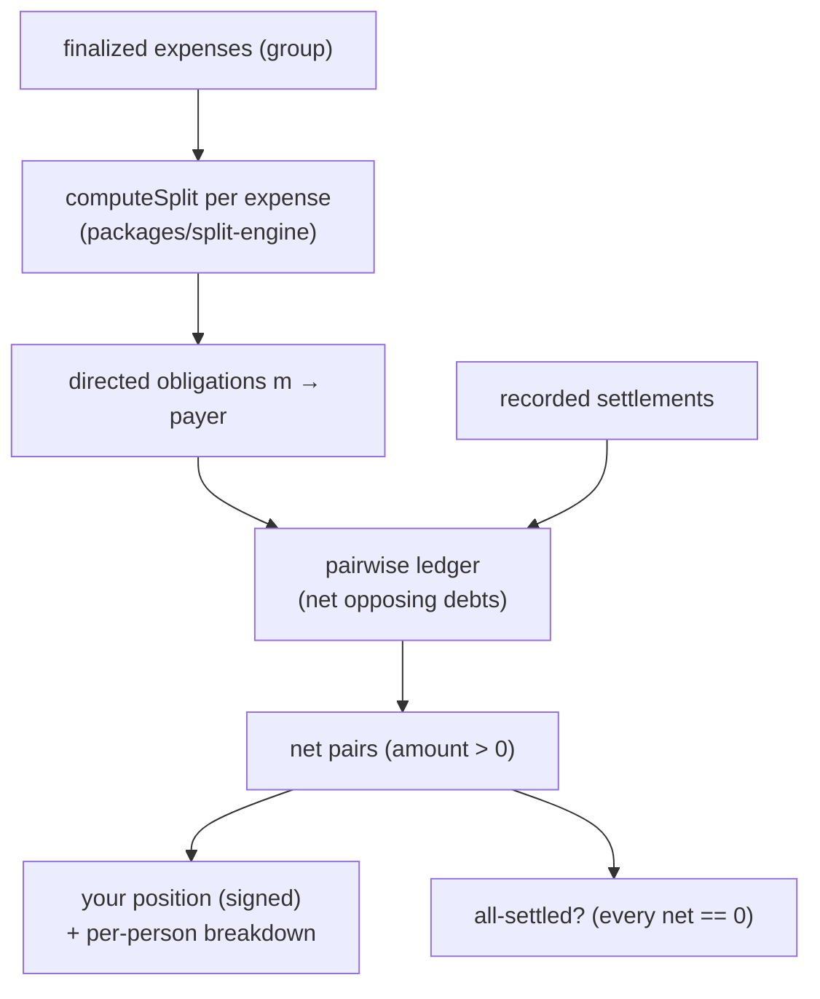

# Design — Balances & Settle-up

> Inherits `.kiro/steering/` context. Money is integer pence throughout; display formats to
> `£x.xx`. All reads/writes are scoped to the authenticated user's memberships.

## Overview

Balances turns a group's finalized expenses plus its recorded settlements into one net
"who owes whom" view, highlights the signed-in user's position with the semantic money colours
(`--pos` / `--neg`), and lets the user record a payment as **mark-as-paid** (record-keeping
only — no money moves in V1). An activity feed surfaces expenses added, settlements recorded,
and members joined, newest-first, on Home and per group.

The frontend is built first against a typed mock of the API client, then the backend
(balance aggregation via `packages/split-engine`, a settlements repository/handler, an
activity repository/handler) fulfils the same contract, then the real Eden client is wired in.

## Architecture

### The balance math (group level)

Balances are **derived**, never stored. For a group the backend:

1. **Loads finalized expenses.** `ExpensesRepository.listByGroup(groupId)` filtered to
   `status === "finalized"`. Drafts are ignored.
2. **Expands each expense into per-member obligations** using the canonical split engine.
   Each expense is **single-payer**: the payer fronted the whole bill, so every other assigned
   member owes the payer their share. For expense `e` with payer `p`:

   ```
   shares = computeSplit(e.items, e.adjustments, e.memberIds)   // pence-exact, sums to total
   for each member m != p:
       obligation(m -> p) += shares[m]                          // m owes p
   ```

   `computeSplit` applies largest-remainder rounding so `Σ shares == e.total` exactly, and
   distributes adjustments (tax/tip/service/discount) pro-rata to each member's assigned
   subtotal. This **replaces** the legacy `finalize/computeBalances.ts`, whose independent
   per-share `Math.round` can mis-sum and which skips adjustments.

3. **Accumulates directed obligations into a pairwise ledger.** Keyed by the unordered pair
   `{a, b}`, track a signed running total. Adding `obligation(m -> p)` adds `+amount` in the
   `m→p` direction. This naturally **nets opposing debts across many expenses**: if expense 1
   gives `A→B 500` and expense 2 gives `B→A 300`, the pair ledger holds `A→B 200`.

4. **Subtracts recorded settlements.** For each settlement `s (from f, to t, amount x)` in the
   group, apply `-x` in the `f→t` direction of the pair ledger. A settlement reduces what `f`
   owes `t`. (Requirement 3.5 guarantees a settlement never exceeds the live outstanding net,
   so the ledger cannot be driven past zero into a spurious reverse debt.)

5. **Emits net pairs.** For each pair with a non-zero net, emit
   `{ fromMemberId, toMemberId, amount }` with `amount > 0` and `from` = the net debtor. Pairs
   that net to `0` are omitted (Requirement 1.5).

6. **Computes the user's position.** `yourNet = Σ(amount where to == you) − Σ(amount where
from == you)`. Positive ⇒ owed (`--pos`); negative ⇒ owes (`--neg`); zero ⇒ neutral. The
   per-person breakdown is the subset of net pairs that include the user.



### Where the code lives

- `microservices/core/src/application/balances/` — `balancesService` + `balancesHandler`
  (read-only aggregation; depends on `ExpensesRepository`, `SettlementsRepository`,
  `GroupsRepository` for membership/member-list).
- `microservices/core/src/application/settlements/` — `SettlementsRepository`,
  `settlementsService`, `settlementsHandler`.
- `microservices/core/src/application/activity/` — `ActivityRepository`, `activityService`,
  `activityHandler`.
- Repositories follow the existing layering: repositories own persistence + ownership/scoping;
  services own domain logic; handlers are thin (validate → service → map result/error).

## Components & Interfaces

### Mobile (Expo + Tamagui), `packages/mobile/src/features/balances/`

- **`BalancesScreen`** — per group. Renders: a hero card with the user's signed net position
  (`--pos`/`--neg`/neutral) and "N still to settle"; a "who owes you" list and a "you owe"
  list, each row = people-palette `Avatar` + member name + amount + a **Settle up** action;
  the persistent footnote "V1 records payments — no money actually moves"; and the **all
  settled up** empty state when every net is zero. Server state via TanStack Query
  (`useGroupBalances(groupId)`).
- **`SettleUpSheet`** — bottom sheet for one pair. Shows from-avatar → to-avatar, "X pays you"
  / "you pay X", the outstanding amount, and a **Mark as paid** button (the only money-ish
  action; no real transfer). On success it shows the settled confirmation, invalidates the
  balances + activity queries, and the screen recomputes (incl. transitioning to all-settled).
  A "Send a reminder instead" secondary action is non-destructive and out of scope to wire.
- **`ActivityFeed`** — list used on Home (all groups) and on a group screen (single group).
  Each row = acting member `Avatar`, text line, optional `£x.xx` amount, relative time;
  settlement rows carry the `--pos` settled treatment. Via `useActivity({ groupId? })`.
- **Mock client** — `adapters/api/mock/balances.ts` returns typed fixtures matching the API
  contract (mirrors the prototype `data.jsx`: `yourBalance` pos/neg/zero groups, `activity`
  entries with a `settled` flag) so all three screens build before the backend exists.

### Backend (Elysia handlers on Lambda)

- **`balancesHandler`** — `GET /groups/:groupId/balances`. Asserts membership, runs
  `balancesService.computeForGroup(groupId, userMemberId)`, returns net pairs + the user's
  position + `allSettled`.
- **`settlementsHandler`** — `POST /groups/:groupId/settlements` (record) and
  `GET /groups/:groupId/settlements` (list). Validates the pair, amount ≤ outstanding net, and
  membership; writes via `SettlementsRepository`; appends an activity entry.
- **`activityHandler`** — `GET /activity` (all the user's groups) and
  `GET /groups/:groupId/activity` (one group). Reverse-chronological.

## Data Models

Tables are **defined by the `data-and-persistence` spec** (Drizzle schema in `packages/db`);
this feature **references** them and does not redefine them. Relevant tables:

- **`settlements`** — `id`, `groupId` (fk), `fromMemberId` (fk), `toMemberId` (fk),
  `amount` (integer pence, > 0), `currency` (default `GBP`), `createdAt`, `createdByUserId`.
- **`activity`** — `id`, `groupId` (fk), `type` (`expense_added` | `settlement` |
  `member_joined`), `actorMemberId` (fk), `amount` (nullable integer pence),
  `expenseId` / `settlementId` (nullable fk), `createdAt`.

Balances are **not** a table — they are derived from `expenses` (status `finalized`),
`expense_items`/assignments, `adjustments`, and `settlements`. The directed-net shape reuses
the existing `Balance` type (`microservices/core/src/domain/types.ts`):
`{ groupId, fromMemberId, toMemberId, amount }` (amount = positive pence, `from` owes `to`).
Per `tech.md`, migrate `CustomShare.fraction` → integer weights and default currency to GBP as
part of the split-engine/db work this depends on.

## API Contract

Types flow over Eden from the Elysia app (no hand-duplicated FE types). Amounts are integer
pence. Shapes (TypeBox on the wire):

```ts
// GET /groups/:groupId/balances
type BalancesResponse = {
  groupId: string;
  // signed net for the authenticated user's member: + = owed to you, − = you owe
  yourPositionPence: number;
  pairsToSettle: number; // count of non-zero net pairs involving the user
  allSettled: boolean; // true when every net pair in the group is 0
  // every non-zero net pair in the group; from owes to; amount > 0
  netPairs: Array<{
    fromMemberId: string;
    toMemberId: string;
    amountPence: number;
  }>;
  // convenience splits of the user's pairs for the two lists
  owesYou: Array<{ memberId: string; amountPence: number }>; // others → you
  youOwe: Array<{ memberId: string; amountPence: number }>; // you → others
};

// POST /groups/:groupId/settlements   (record-keeping only — no money moves)
type CreateSettlementBody = {
  fromMemberId: string; // the debtor (who "paid")
  toMemberId: string; // the creditor
  amountPence: number; // > 0, must be ≤ current outstanding net for the pair
};
type Settlement = {
  id: string;
  groupId: string;
  fromMemberId: string;
  toMemberId: string;
  amountPence: number;
  currency: "GBP";
  createdAt: string; // ISO
};

// GET /groups/:groupId/settlements -> Settlement[]

// GET /activity            (all the user's groups)
// GET /groups/:groupId/activity   (one group)
type ActivityEntry = {
  id: string;
  type: "expense_added" | "settlement" | "member_joined";
  groupId: string;
  groupName: string; // denormalized for Home rendering
  actorMemberId: string;
  text: string; // e.g. "Theo paid for Groceries"
  amountPence: number | null;
  settled: boolean; // true for settlement entries
  createdAt: string; // ISO; list is newest-first
};
type ActivityResponse = ActivityEntry[];
```

## Error Handling

Uses the global structured error handler (request-id correlation, prod-safe stack traces).

- **404 / not-authorized** — user is not a member of the group (Req 6.2), or a referenced
  member/group is inaccessible (Req 6.3). No data returned, nothing recorded.
- **400 validation** — `amountPence ≤ 0`; `fromMemberId == toMemberId`; member not in group;
  `amountPence` exceeds the live outstanding net for the pair (Req 3.5) — recompute the net
  inside the same request before writing to avoid a stale-read overpay.
- **401** — missing/invalid JWT; the acting user is derived from the verified token, never
  from the body (Req 6.4).
- **Empty / all-settled** — not an error: balances return `allSettled: true` with empty lists;
  activity returns `[]`.
- **Idempotency note** — settlements are append-only events; a duplicate submit would record a
  second settlement, but the `amount ≤ outstanding net` check prevents driving a pair negative.

## Testing Strategy

Vitest + v8 coverage at the repo threshold (reference 90%) for backend/shared; Jest + RN
Testing Library for mobile.

**Aggregation (unit, `balancesService`):**

- Single expense, single payer → others owe payer their exact shares; shares sum to total.
- Multi-expense netting: opposing debts across expenses net to one directed pair.
- Pairs netting to `0` are omitted; `allSettled` true when all nets are `0`.
- Settlement subtracts from the pair net; partial settlement leaves a smaller positive net.
- Adjustments distributed pro-rata via the split engine; no per-share rounding drift
  (Σ shares == total) — guards the `computeBalances` replacement.
- Draft expenses excluded.

**Settlements (unit + handler):** records with timestamp; rejects amount > outstanding net,
zero/negative amount, self-pair, non-member; appends an activity entry; membership scoping.

**Activity (unit + handler):** newest-first ordering; Home (all groups) vs group-scoped;
settlement entries flagged `settled` + `--pos`; entries created on finalize/settlement/join.

**Ownership (handler):** non-member gets not-authorized on balances/settlements/activity;
acting user comes from JWT, not body.

**Mobile (component):** `BalancesScreen` renders `--pos` for positive / `--neg` for negative /
neutral `£0.00`; per-person lists + accountless placeholder labelling; all-settled state;
`SettleUpSheet` mark-as-paid invalidates queries and flips the pair to settled; the
"no money actually moves" footnote is present; `ActivityFeed` ordering and settlement styling.

**Integration (wire-up):** finalize → balances reflects new obligation; record settlement →
balances net drops and an activity entry appears; settling the last pair → all-settled.
