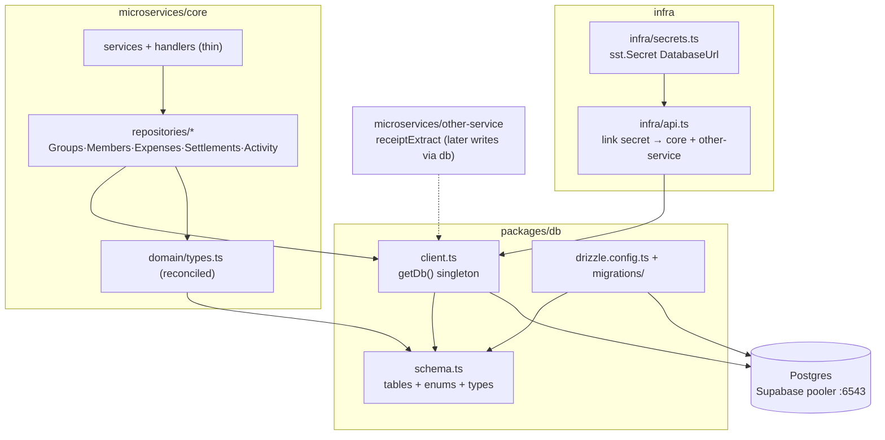
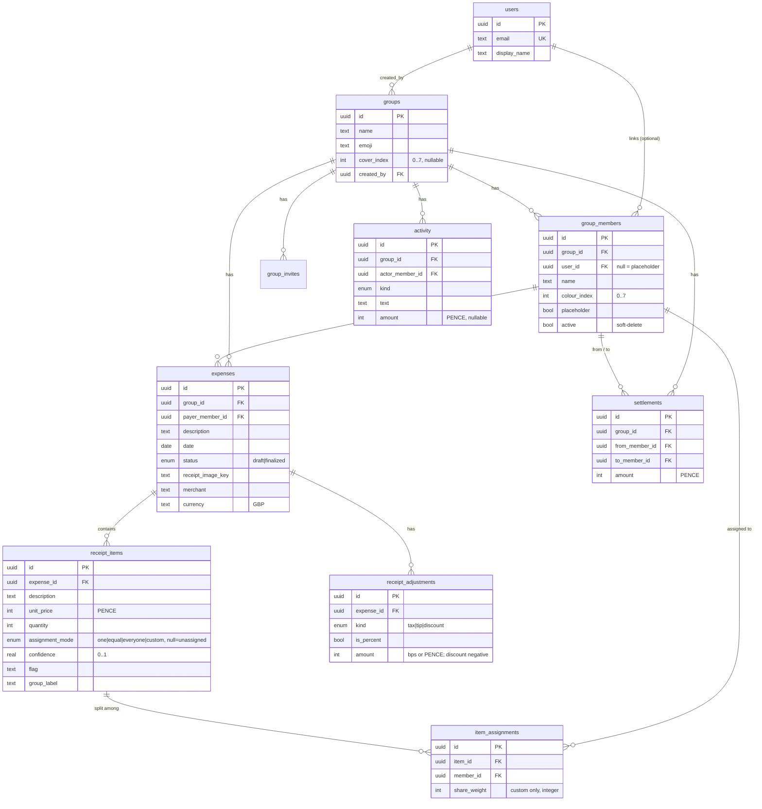

# Design — Data & Persistence

> Feature #2 (`data-and-persistence`), BE foundation. Inherits `.kiro/steering/*`.
> Companion: `requirements.md` (this folder).

## Overview

`packages/db` becomes the single persistence layer for Divvy Up. It bundles:

- a **Drizzle schema** (`src/schema.ts`) defining every domain entity with **money as
  integer pence** and **custom splits as integer share weights**;
- a **`getDb()` singleton client** (`src/client.ts`) over `postgres-js`, configured for
  Supabase's transaction-mode pooler under Lambda;
- **Drizzle CLI** config + scripts and a **checked-in initial migration**;
- the **secret** (`infra/secrets.ts`) carrying the connection string per stage.

The stubbed in-memory repositories in `microservices/core` are then **rewritten against
Drizzle** with `userId`/`groupId` ownership scoping, new repositories are added for members,
settlements, and activity, and `domain/types.ts` is reconciled to the schema. Repository
tests run against a sandbox Postgres.

This feature does **not** compute splits or balances (feature #3 owns the split engine) and
does **not** verify JWTs (feature #4 owns auth). It defines the seams those features plug
into: repositories take a `userId`; the schema stores split inputs (weights, modes) and
record-keeping outputs (settlements).

### Mirrors the reference app

The client, package layout, and pooler guidance mirror
`persistence-backend-sst/packages/db`: same `postgres-js` driver, same `prepare:false`/`max:1`
rationale, same `Resource`→`env` fallback, same `db:*` scripts. We diverge in one place: the
reference applies hand-written SQL under `supabase/migrations/`, whereas tech.md mandates the
**Drizzle CLI** flow (`db:generate` from the TypeScript schema → versioned migration under
`packages/db/migrations`).

---

## Architecture



**Layering** (matches `structure.md`): handlers stay thin (validate → service → map);
**services** own domain logic; **repositories** own persistence **and** ownership/scoping
checks. Repositories depend on `getDb()` (or an injected `Db` for tests); they never touch
the request directly.

---

## Components & Interfaces

### `packages/db/src/client.ts`

```ts
import { drizzle } from "drizzle-orm/postgres-js";
import postgres from "postgres";
import * as schema from "./schema";

function getDatabaseUrl(): string {
  try {
    const { Resource } = require("sst");
    if (Resource.DivvyUpDatabaseUrl?.value)
      return Resource.DivvyUpDatabaseUrl.value;
  } catch {
    /* Resource not present (local / tests) — fall through */
  }
  const url = process.env.DATABASE_URL;
  if (!url) {
    throw new Error(
      "DATABASE_URL is not set. Set the secret: sst secret set DivvyUpDatabaseUrl <url>",
    );
  }
  return url;
}

// prepare:false → required behind pgbouncer transaction mode.
// max:1         → one Lambda container handles one request at a time.
export function createDb(databaseUrl?: string) {
  const sql = postgres(databaseUrl ?? getDatabaseUrl(), {
    prepare: false,
    max: 1,
  });
  return drizzle(sql, { schema });
}

let _db: ReturnType<typeof createDb> | null = null;
export function getDb() {
  if (!_db) _db = createDb();
  return _db;
}
export type Db = ReturnType<typeof createDb>;
```

### `packages/db/drizzle.config.ts`

```ts
import { defineConfig } from "drizzle-kit";

export default defineConfig({
  schema: "./src/schema.ts",
  out: "./migrations",
  dialect: "postgresql",
  dbCredentials: { url: process.env.DATABASE_URL! },
  strict: true,
  verbose: true,
});
```

### `infra/secrets.ts`

```ts
// Supabase transaction-mode pooler URL (port 6543), set per stage from CI via
//   bunx sst secret set DivvyUpDatabaseUrl "<url>" --stage <stage>
// Never file-committed; never pasted into logs or PR descriptions.
export const databaseUrl = new sst.Secret("DivvyUpDatabaseUrl");
```

`infra/api.ts` links the secret to both functions so `Resource.DivvyUpDatabaseUrl.value`
resolves at runtime:

```ts
coreAPI.route("$default", {
  handler: "microservices/core/src/api.handler",
  link: [databaseUrl],
});
receiptServiceAPI.route("$default", {
  handler: "microservices/other-service/src/api.handler",
  link: [databaseUrl],
});
```

---

## Data Models

The schema is the centrepiece. All money columns are `integer` **pence**. Custom splits use
**integer `share_weight`**, never floats.

### Enums

```ts
export const expenseStatus = pgEnum("expense_status", ["draft", "finalized"]);
export const assignmentMode = pgEnum("assignment_mode", [
  "one",
  "equal",
  "everyone",
  "custom",
]);
export const adjustmentKind = pgEnum("adjustment_kind", [
  "tax",
  "tip",
  "discount",
]);
export const activityKind = pgEnum("activity_kind", [
  "expense_added", // emitted when an expense is finalized (becomes part of balances)
  "settled_up",
  "member_added",
]);
```

### Tables (Drizzle, `src/schema.ts`)

```ts
import {
  pgTable,
  pgEnum,
  uuid,
  text,
  integer,
  real,
  boolean,
  timestamp,
  date,
  primaryKey,
  uniqueIndex,
  index,
  check,
  foreignKey,
} from "drizzle-orm/pg-core";
import { sql, relations } from "drizzle-orm";

// ── users ── (id == Supabase Auth user id)
export const users = pgTable("users", {
  id: uuid("id").primaryKey(), // == Supabase auth.users.id (the JWT `sub`); no separate column
  email: text("email").notNull().unique(),
  // nullable: base JWT claims carry no name; provisioning derives from email / user_metadata
  displayName: text("display_name"),
  createdAt: timestamp("created_at", { withTimezone: true })
    .notNull()
    .defaultNow(),
  updatedAt: timestamp("updated_at", { withTimezone: true })
    .notNull()
    .defaultNow(),
});

// ── groups ──
export const groups = pgTable(
  "groups",
  {
    id: uuid("id").primaryKey().defaultRandom(),
    name: text("name").notNull(),
    emoji: text("emoji"), // e.g. "🍝"
    coverIndex: integer("cover_index"), // people-palette slot 0..7 → --p1..--p8 (nullable)
    createdBy: uuid("created_by")
      .notNull()
      .references(() => users.id),
    createdAt: timestamp("created_at", { withTimezone: true })
      .notNull()
      .defaultNow(),
    updatedAt: timestamp("updated_at", { withTimezone: true })
      .notNull()
      .defaultNow(),
  },
  (t) => ({
    byCreator: index("groups_created_by_idx").on(t.createdBy),
    coverRange: check(
      "groups_cover_index_range",
      sql`${t.coverIndex} is null or (${t.coverIndex} between 0 and 7)`,
    ),
  }),
);

// ── group_members ── (join: group ↔ person; person may be accountless)
export const groupMembers = pgTable(
  "group_members",
  {
    id: uuid("id").primaryKey().defaultRandom(),
    groupId: uuid("group_id")
      .notNull()
      .references(() => groups.id, { onDelete: "cascade" }),
    userId: uuid("user_id").references(() => users.id, {
      onDelete: "set null",
    }), // null = placeholder
    name: text("name").notNull(), // display name (placeholder or cached)
    colourIndex: integer("colour_index").notNull(), // 0..7 people-palette slot → --p1..--p8
    placeholder: boolean("placeholder").notNull().default(false),
    // soft-delete: members referenced by expenses/assignments (FK restrict) can't be hard-deleted,
    // so removal flips `active` to false. Ownership is NOT a column — it is derived
    // (`group_members.user_id == groups.created_by`).
    active: boolean("active").notNull().default(true),
    createdAt: timestamp("created_at", { withTimezone: true })
      .notNull()
      .defaultNow(),
  },
  (t) => ({
    byGroup: index("group_members_group_idx").on(t.groupId),
    // one membership per real account per group (placeholders have null user_id, excluded)
    uniqUserPerGroup: uniqueIndex("group_members_group_user_uniq")
      .on(t.groupId, t.userId)
      .where(sql`${t.userId} is not null`),
    colourRange: check(
      "group_members_colour_range",
      sql`${t.colourIndex} between 0 and 7`,
    ),
  }),
);

// ── group_invites ── (invite tokens; owned here, referenced by groups-and-members #5)
export const groupInvites = pgTable(
  "group_invites",
  {
    id: uuid("id").primaryKey().defaultRandom(),
    groupId: uuid("group_id")
      .notNull()
      .references(() => groups.id, { onDelete: "cascade" }),
    // the placeholder seat this invite fills, if any (null = open invite → new member on accept)
    memberId: uuid("member_id").references(() => groupMembers.id, {
      onDelete: "set null",
    }),
    tokenHash: text("token_hash").notNull(), // store a HASH, never the raw token
    createdBy: uuid("created_by")
      .notNull()
      .references(() => users.id),
    expiresAt: timestamp("expires_at", { withTimezone: true }).notNull(),
    usedAt: timestamp("used_at", { withTimezone: true }), // null until accepted
    createdAt: timestamp("created_at", { withTimezone: true })
      .notNull()
      .defaultNow(),
  },
  (t) => ({
    uniqTokenHash: uniqueIndex("group_invites_token_hash_uniq").on(t.tokenHash),
    byGroup: index("group_invites_group_idx").on(t.groupId),
  }),
);

// ── expenses ── (single payer; pence)
export const expenses = pgTable(
  "expenses",
  {
    id: uuid("id").primaryKey().defaultRandom(),
    groupId: uuid("group_id")
      .notNull()
      .references(() => groups.id, { onDelete: "cascade" }),
    payerMemberId: uuid("payer_member_id")
      .notNull()
      .references(() => groupMembers.id, { onDelete: "restrict" }),
    description: text("description").notNull(),
    date: date("date").notNull(), // receipt date; writers coalesce an unknown date → today (NOT NULL)
    status: expenseStatus("status").notNull().default("draft"),
    receiptImageKey: text("receipt_image_key"), // S3 key, nullable (manual expense)
    merchant: text("merchant"),
    currency: text("currency").notNull().default("GBP"), // ISO 4217; GBP for V1
    createdBy: uuid("created_by")
      .notNull()
      .references(() => users.id),
    createdAt: timestamp("created_at", { withTimezone: true })
      .notNull()
      .defaultNow(),
    updatedAt: timestamp("updated_at", { withTimezone: true })
      .notNull()
      .defaultNow(),
  },
  (t) => ({
    byGroup: index("expenses_group_idx").on(t.groupId),
  }),
);

// ── receipt_items ── (pence; confidence 0..1; optional flag / group label)
export const receiptItems = pgTable(
  "receipt_items",
  {
    id: uuid("id").primaryKey().defaultRandom(),
    expenseId: uuid("expense_id")
      .notNull()
      .references(() => expenses.id, { onDelete: "cascade" }),
    description: text("description").notNull(),
    unitPrice: integer("unit_price").notNull(), // PENCE
    quantity: integer("quantity").notNull().default(1),
    // The item's assignment MODE lives here (null = unassigned). `everyone` is stored as the mode
    // alone with NO item_assignments rows, so it resolves dynamically to the group's CURRENT
    // members at finalize (a new member is automatically included). `one`/`equal`/`custom` carry
    // member rows in item_assignments.
    assignmentMode: assignmentMode("assignment_mode"), // null until assigned
    // `real` (float4), NOT `numeric` — Drizzle maps `numeric` to a JS **string**, which would
    // break the split engine's `conf < 0.7` and the wire `confidence: number`. `real` returns a
    // number; 0..1 needs no exact decimal precision.
    confidence: real("confidence"), // 0..1, AI only (nullable for manual items)
    flag: text("flag"), // e.g. "Couldn't read who this was for"
    groupLabel: text("group_label"), // e.g. "The wine round"
    sortOrder: integer("sort_order").notNull().default(0),
  },
  (t) => ({
    byExpense: index("receipt_items_expense_idx").on(t.expenseId),
    qtyPositive: check("receipt_items_qty_positive", sql`${t.quantity} > 0`),
    confRange: check(
      "receipt_items_confidence_range",
      sql`${t.confidence} is null or (${t.confidence} >= 0 and ${t.confidence} <= 1)`,
    ),
  }),
);

// ── item_assignments ── (join: item ↔ member; member rows for one|equal|custom only)
// The MODE lives on receipt_items. This table holds the explicit member list for `one` (1 row),
// `equal` (N rows), and `custom` (N rows, each with a positive integer weight). `everyone` and
// `unassigned` items have NO rows here.
export const itemAssignments = pgTable(
  "item_assignments",
  {
    id: uuid("id").primaryKey().defaultRandom(),
    itemId: uuid("item_id")
      .notNull()
      .references(() => receiptItems.id, { onDelete: "cascade" }),
    memberId: uuid("member_id")
      .notNull()
      .references(() => groupMembers.id, { onDelete: "restrict" }),
    shareWeight: integer("share_weight"), // INTEGER weight, custom only (e.g. 2:1); null otherwise
  },
  (t) => ({
    byItem: index("item_assignments_item_idx").on(t.itemId),
    uniqMember: uniqueIndex("item_assignments_item_member_uniq").on(
      t.itemId,
      t.memberId,
    ),
    // a weight, when present, must be a positive integer (custom rows); the repository enforces
    // that weights appear iff the item's mode is `custom`, since that mode lives on receipt_items.
    weightRule: check(
      "item_assignments_weight_rule",
      sql`${t.shareWeight} is null or ${t.shareWeight} > 0`,
    ),
  }),
);

// ── receipt_adjustments ── (tax|tip|discount; percent-or-fixed; pence/bps; discounts negative)
export const receiptAdjustments = pgTable(
  "receipt_adjustments",
  {
    id: uuid("id").primaryKey().defaultRandom(),
    expenseId: uuid("expense_id")
      .notNull()
      .references(() => expenses.id, { onDelete: "cascade" }),
    kind: adjustmentKind("kind").notNull(),
    isPercent: boolean("is_percent").notNull(),
    // when isPercent: rate in basis points (1250 = 12.50%); else fixed PENCE.
    // discounts stored negative.
    amount: integer("amount").notNull(),
    label: text("label"), // e.g. "Service charge"
  },
  (t) => ({
    byExpense: index("receipt_adjustments_expense_idx").on(t.expenseId),
  }),
);

// ── settlements ── (mark-as-paid record only; NO money movement)
export const settlements = pgTable(
  "settlements",
  {
    id: uuid("id").primaryKey().defaultRandom(),
    groupId: uuid("group_id")
      .notNull()
      .references(() => groups.id, { onDelete: "cascade" }),
    fromMemberId: uuid("from_member_id")
      .notNull()
      .references(() => groupMembers.id, { onDelete: "restrict" }),
    toMemberId: uuid("to_member_id")
      .notNull()
      .references(() => groupMembers.id, { onDelete: "restrict" }),
    amount: integer("amount").notNull(), // PENCE recorded as paid
    recordedBy: uuid("recorded_by")
      .notNull()
      .references(() => users.id),
    createdAt: timestamp("created_at", { withTimezone: true })
      .notNull()
      .defaultNow(),
  },
  (t) => ({
    byGroup: index("settlements_group_idx").on(t.groupId),
    notSelf: check(
      "settlements_not_self",
      sql`${t.fromMemberId} <> ${t.toMemberId}`,
    ),
  }),
);

// ── activity ── (feed entries)
export const activity = pgTable(
  "activity",
  {
    id: uuid("id").primaryKey().defaultRandom(),
    groupId: uuid("group_id")
      .notNull()
      .references(() => groups.id, { onDelete: "cascade" }),
    // actor is always known at creation (wire type requires it); members are soft-deleted
    // (active=false), not hard-deleted, so `restrict` is consistent with expenses/settlements.
    actorMemberId: uuid("actor_member_id")
      .notNull()
      .references(() => groupMembers.id, { onDelete: "restrict" }),
    kind: activityKind("kind").notNull(),
    text: text("text").notNull(),
    amount: integer("amount"), // PENCE, nullable
    expenseId: uuid("expense_id").references(() => expenses.id, {
      onDelete: "set null",
    }),
    settlementId: uuid("settlement_id").references(() => settlements.id, {
      onDelete: "set null",
    }),
    createdAt: timestamp("created_at", { withTimezone: true })
      .notNull()
      .defaultNow(),
  },
  (t) => ({
    byGroupRecent: index("activity_group_created_idx").on(
      t.groupId,
      t.createdAt,
    ),
  }),
);
```

**Schema-inferred types** are the source of truth, e.g.:

```ts
export type GroupRow = typeof groups.$inferSelect;
export type NewGroupRow = typeof groups.$inferInsert;
export type GroupMemberRow = typeof groupMembers.$inferSelect;
export type ExpenseRow = typeof expenses.$inferSelect;
export type ReceiptItemRow = typeof receiptItems.$inferSelect;
export type ItemAssignmentRow = typeof itemAssignments.$inferSelect;
// …etc for adjustments, settlements, activity
```

### ER diagram



### Design notes on the joins (the rigorous bits)

- **`group_members` is the canonical "person".** Expenses, assignments, and settlements all
  reference `group_members.id`, **not** `users.id`. This makes accountless placeholders
  first-class: a placeholder is a `group_members` row with `user_id = null` and
  `placeholder = true`. `linkUser` later sets `user_id` and flips `placeholder` to false
  without rewriting any expense/assignment rows.
- **Membership uniqueness** is a partial unique index over `(group_id, user_id)` that only
  applies where `user_id is not null` — two placeholders named "Sam" are allowed; the same
  account joined twice is not. **Re-adding a removed account:** because soft-delete sets
  `active = false` but **keeps `user_id`**, a previously-removed member still occupies the
  unique slot. `addMember` / invite-accept therefore **reactivate the existing row**
  (`active = true`, refresh `name`/colour as needed) when a row for `(group_id, user_id)`
  already exists, rather than inserting a duplicate (which would violate the index).
- **Assignment modes:** the item's `assignment_mode` lives on `receipt_items` (null =
  unassigned). `one` (1 row), `equal` (N rows, `share_weight = null`), and `custom` (N rows with a
  **positive integer `share_weight`**) record their member lists in `item_assignments`.
  **`everyone` stores NO `item_assignments` rows** — it is the mode alone, resolved to the group's
  **current** members at finalize, so a member who joins later is automatically included (this is
  why the split engine resolves `everyone` from a passed `memberIds`, rather than from stored
  rows). Keeping the mode on the item is what lets `everyone` avoid a `member_id` (which is
  `NOT NULL` here).
- **Same-group integrity:** `payer_member_id` and every assignment's `member_id` must belong
  to the expense's group. The FK guarantees the row exists; the repository asserts the
  group match in the same transaction (a pure FK can't express "same group as the parent
  expense").

---

## API Contract (repository method signatures)

Repositories live in `microservices/core/src/application/repositories/`. Each takes a `Db`
(defaulting to `getDb()`) and enforces `userId` scoping. `static readonly key` identifiers
are preserved for the existing Elysia `.decorate()` DI.

```ts
import type { Db } from "@divvy-up/db";

// ── GroupsRepository ──
class GroupsRepository {
  static readonly key = "GroupsRepository";
  constructor(db?: Db);
  list(userId: string): Promise<Group[]>; // only groups user is a member of
  create(
    userId: string,
    input: { name: string; emoji?: string; coverIndex?: number },
  ): Promise<Group>;
  findById(userId: string, id: GroupId): Promise<Group | null>; // null if not a member
}

// ── MembersRepository ──
class MembersRepository {
  static readonly key = "MembersRepository";
  constructor(db?: Db);
  listByGroup(userId: string, groupId: GroupId): Promise<Member[]>;
  // Resolve the caller's own membership in a group → their group_members row (or null if not an
  // active member). The single "userId → memberId in this group" lookup that handlers need for
  // payer resolution (receipts), the user's net position (balances), and membership guards.
  findMembership(userId: string, groupId: GroupId): Promise<Member | null>;
  addMember(
    userId: string,
    groupId: GroupId,
    input: {
      name: string;
      colourIndex: number;
      placeholder?: boolean;
      userId?: string;
    },
  ): Promise<Member>;
  linkUser(
    userId: string,
    memberId: MemberId,
    linkedUserId: string,
  ): Promise<Member | null>;
  remove(userId: string, memberId: MemberId): Promise<boolean>;
}

// ── GroupInvitesRepository ── (group_invites table; consumed by groups-and-members #5)
class GroupInvitesRepository {
  static readonly key = "GroupInvitesRepository";
  constructor(db?: Db);
  create(
    userId: string,
    groupId: GroupId,
    input: { memberId?: MemberId; tokenHash: string; expiresAt: string },
  ): Promise<{ id: string }>;
  findByTokenHash(tokenHash: string): Promise<{
    id: string;
    groupId: GroupId;
    memberId: MemberId | null;
    expiresAt: string;
    usedAt: string | null;
  } | null>;
  markUsed(id: string): Promise<void>;
}

// ── ExpensesRepository ──
class ExpensesRepository {
  static readonly key = "ExpensesRepository";
  constructor(db?: Db);
  create(userId: string, input: CreateExpenseInput): Promise<Expense>; // tx: expense+items+assignments+adjustments
  findById(userId: string, id: ExpenseId): Promise<Expense | null>; // hydrated
  listByGroup(userId: string, groupId: GroupId): Promise<Expense[]>;
  updateItemAssignment(
    userId: string,
    expenseId: ExpenseId,
    itemId: ReceiptItemId,
    assignment: ItemAssignment,
  ): Promise<Expense | null>; // tx: replace rows
  finalize(userId: string, expenseId: ExpenseId): Promise<Expense | null>; // status → finalized
}

// ── SettlementsRepository ──
class SettlementsRepository {
  static readonly key = "SettlementsRepository";
  constructor(db?: Db);
  record(
    userId: string,
    input: {
      groupId: GroupId;
      fromMemberId: MemberId;
      toMemberId: MemberId;
      amount: number;
    },
  ): Promise<Settlement>;
  listByGroup(userId: string, groupId: GroupId): Promise<Settlement[]>;
}

// ── ActivityRepository ──
class ActivityRepository {
  static readonly key = "ActivityRepository";
  constructor(db?: Db);
  append(
    userId: string,
    entry: {
      groupId: GroupId;
      kind: ActivityKind;
      text: string;
      amount?: number;
      actorMemberId: MemberId; // required — the actor is always known
      expenseId?: ExpenseId;
      settlementId?: SettlementId;
    },
  ): Promise<Activity>;
  listByGroup(
    userId: string,
    groupId: GroupId,
    limit?: number,
  ): Promise<Activity[]>; // most-recent-first
}
```

`CreateExpenseInput` (pence throughout, integer weights):

```ts
type CreateExpenseInput = {
  groupId: GroupId;
  payerMemberId: MemberId;
  description: string;
  date: string; // ISO date
  merchant?: string;
  currency?: string; // default "GBP"
  receiptImageKey?: string;
  items: Array<{
    description: string;
    unitPrice: number; // PENCE
    quantity: number;
    confidence?: number; // 0..1
    flag?: string;
    groupLabel?: string;
    assignment: ItemAssignment;
  }>;
  adjustments?: Array<{
    kind: AdjustmentKind;
    isPercent: boolean;
    amount: number; // bps if percent, else PENCE; discount negative
    label?: string;
  }>;
};
```

### Reconciled `domain/types.ts`

```ts
// Id aliases (extend the existing GroupId/MemberId/ExpenseId/ReceiptItemId in domain/types.ts)
export type SettlementId = string;
export type ActivityId = string;
export type CustomShare = { memberId: MemberId; weight: number }; // integer weight ≥ 1, was float fraction
export type Member = {
  id: MemberId;
  groupId: GroupId;
  name: string;
  colourIndex: number; // 0..7
  placeholder: boolean;
  active: boolean; // false = soft-removed
  userId?: string;
};
export type Group = {
  id: GroupId;
  name: string;
  emoji?: string;
  coverIndex?: number; // 0..7 people-palette slot
  createdAt: string;
  members: Member[];
};
export type ReceiptItem = {
  id: ReceiptItemId;
  expenseId: ExpenseId;
  description: string;
  unitPrice: number;
  quantity: number;
  assignment: ItemAssignment;
  confidence?: number;
  flag?: string;
  groupLabel?: string;
};
// Expense.currency default "GBP" (was "USD").
```

Where practical these are derived from / aligned to `$inferSelect` shapes from
`@divvy-up/db` rather than hand-maintained in parallel.

---

## Error Handling

- **Missing connection string** — `getDatabaseUrl()` throws a descriptive error naming
  `DivvyUpDatabaseUrl` and `DATABASE_URL`. Surfaces at first query, caught by the (future)
  global handler as a 500.
- **Not-found vs not-authorised** — when a `userId` is not a member of the target group,
  reads return `null`/`[]` and writes return `null`/`false`. The repository **never**
  distinguishes "doesn't exist" from "not yours" (Req 7.4) to avoid leaking existence.
- **Constraint violations** — surfaced as thrown errors and translated by the service layer:
  - unique membership / assignment violations → `409 Conflict`-shaped domain error;
  - CHECK violations (negative quantity, bad confidence, custom weight rule) → these are
    programming errors; repositories validate inputs **before** insert so the CHECK is a
    last line of defence, not the primary path.
- **Transactions** — `create`, `updateItemAssignment`, and `create`+`group_members` (group
  create) run inside `db.transaction(...)`; a failure rolls back the whole unit so no partial
  expense/assignment graph is ever persisted.
- **Cross-group references** — repositories assert that `payerMemberId` and all assignment
  `memberId`s belong to the expense's group inside the transaction; a mismatch throws and
  rolls back.

---

## Testing Strategy

Vitest, mirroring the reference app's repository tests; coverage at the repo threshold.

- **Sandbox DB.** A test `DATABASE_URL` points at a disposable Postgres (local Supabase /
  ephemeral container / a dedicated test schema). A global setup runs `db:migrate` (or
  `drizzle-kit push`) once before the suite. `createDb(testUrl)` gives each suite an isolated
  client; `getDb()` is not used in tests.
- **Isolation.** A `beforeEach` truncates all tables (`TRUNCATE … RESTART IDENTITY CASCADE`)
  so cases are independent.
- **Skip when unconfigured.** If `DATABASE_URL` is absent, DB-backed describe blocks
  `describe.skip` with a clear console message — the unit suite (pure helpers, input
  validation) still runs and CI without a DB stays green; the DB suite runs in the CI job
  that provisions Postgres.
- **What we assert:**
  1. **Pence round-trip** — insert `unit_price`, `amount`, settlement `amount` as integers;
     read back identical, no precision loss.
  2. **Custom weights** — a `custom` assignment persists integer weights; the `weightRule`
     CHECK rejects a zero/negative weight and rejects a non-null weight on `everyone`.
  3. **Confidence range** — values outside `0..1` are rejected.
  4. **Ownership scoping** — a `userId` not in a group gets `null`/`[]` from `findById`/
     `list`/`listByGroup` and cannot `updateItemAssignment`/`finalize`/`record`.
  5. **Membership uniqueness** — adding the same account to a group twice is rejected;
     two placeholders with the same name are allowed.
  6. **Assignment uniqueness** — assigning the same member to one item twice is rejected.
  7. **Transactional create** — a create that violates a constraint mid-way leaves zero rows.
  8. **Finalize** — `finalize` flips `draft → finalized` and is idempotent / scoped.
  9. **Activity ordering** — `listByGroup` returns most-recent-first and respects `limit`.
- **Existing handler/service tests** continue to pass against the new repository signatures
  (they receive a `userId` and an injected test `Db`).
