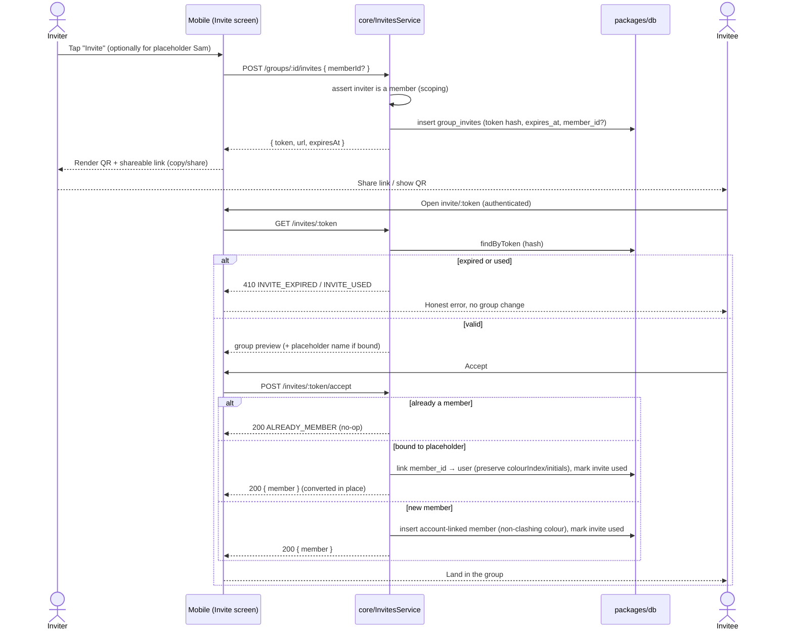

# Design — Groups & Members

> Implements `requirements.md` for feature #5. Inherits `.kiro/steering/` context.
> FE↔BE bridge is the **API Contract** section below (the eden type contract).

## Overview

This feature delivers the group + member lifecycle for Divvy Up, mobile-first then backend:

- **Mobile**: Home group cards, Groups list, create-group flow, manage-group (rename / emoji /
  cover / add / remove), and invite (link + QR + accept). All people render through the
  people-colour avatar primitive.
- **Backend**: `groups` and `group_members` repositories + Elysia handlers in
  `microservices/core` for create/list/get/update/delete group, add/remove/list members,
  placeholder creation, deterministic **colour-index assignment**, and **invite create / accept**.
  Everything is scoped to the authenticated user's memberships against `packages/db`.

The existing `microservices/core/src/application/groups/list/` handler and the stubbed
`GroupsRepository` are the seed; this feature **rewrites the repository against `packages/db`**
and expands the handler surface. The DB schema itself is owned by the `data-and-persistence`
spec — this design **references** those tables (`groups`, `group_members`, `group_invites`) and
does not redefine them.

## Architecture

Layering follows `steering/structure.md`: **handlers** are thin (validate → call service → map
result/error), **services** own domain logic (colour assignment, placeholder conversion, invite
rules), **repositories** own persistence + ownership/scoping checks against Drizzle/`packages/db`.

```
packages/mobile (Expo + expo-router + Tamagui)
  features/groups/
    HomeScreen           GroupsListScreen
    CreateGroupScreen    ManageGroupScreen    InviteScreen / AcceptInviteScreen
    hooks (TanStack Query) ── useGroups, useGroup, useCreateGroup, useUpdateGroup,
                              useAddMember, useRemoveMember, useCreateInvite, useAcceptInvite
        │
        ▼  eden/treaty typed client  (adapters/api)
─────────────────────────────────────────────────────────────────────────────
microservices/core  (Elysia on Lambda)
  application/groups/{list,get,create,update,delete}/  →  GroupsService
  application/members/{list,add,remove}/               →  MembersService
  application/invites/{create,accept}/                 →  InvitesService
        │                         │                         │
        ▼                         ▼                         ▼
  GroupsRepository        GroupMembersRepository      GroupInvitesRepository
        └──────────── colourAssignment (pure) ───────────┘
        │
        ▼  packages/db (Drizzle) → Postgres / Supabase
```

The mobile screens are built **first against a typed mock of the eden client** (a hand-rolled
in-memory implementation of the same contract), then the real backend is wired in.

## Components & Interfaces

### Mobile screens

| Screen               | Route (expo-router)        | Responsibilities                                                          | Key requirements  |
| -------------------- | -------------------------- | ------------------------------------------------------------------------- | ----------------- |
| **Home**             | `(app)/index`              | Group cards: emoji, cover, avatar stack, your-balance chip; tap → group   | 1.1–1.3, 1.7, 1.8 |
| **Groups list**      | `(app)/groups`             | Full list + "Start a new group"; empty/loading/error states               | 1.4–1.6           |
| **Create group**     | `(app)/groups/new`         | Name, emoji + cover picker, members (add by name + suggested), gated CTA  | 2.1–2.7           |
| **Manage group**     | `(app)/groups/[id]/manage` | Rename / emoji / cover; member list with add/remove; delete               | 3.1–3.4, 4.1–4.4  |
| **Invite (QR/link)** | `(app)/groups/[id]/invite` | Generate invite, render QR, copy/share link; optional placeholder binding | 6.1, 6.2, 6.8     |
| **Accept invite**    | `(app)/invite/[token]`     | Resolve token, show group preview, accept → join                          | 6.3–6.6           |

Shared primitives (from `mobile-app-foundation`): `Avatar` (people-colour + initials + dashed ring
for placeholders), `AvatarStack`, `MoneyText` (`--pos`/`--neg`), `Sheet`, `Button`,
emoji/colour pickers. This feature must not redefine those primitives, only compose them.

The mobile client never invents colours: it reads `colourIndex` from the API and maps it to the
Tamagui people-palette token (`--p1…--p8`). Initials may be rendered from `initials` returned by
the API (preferred) and recomputed client-side only as a display fallback.

### Repository methods (against `packages/db`)

```ts
// GroupsRepository — all reads/writes scoped by userId membership
list(userId: string): Promise<GroupSummary[]>          // groups the user belongs to + member avatars + their balance hook
get(userId: string, groupId: string): Promise<GroupDetail | null> // null if not a member (uniform not-found)
create(userId: string, input: CreateGroupInput): Promise<GroupDetail>
update(userId: string, groupId: string, patch: UpdateGroupPatch): Promise<GroupDetail> // owner-only
remove(userId: string, groupId: string): Promise<void>  // owner-only

// GroupMembersRepository
listMembers(userId: string, groupId: string): Promise<Member[]>
addPlaceholder(userId: string, groupId: string, name: string): Promise<Member>  // assigns colourIndex
removeMember(userId: string, groupId: string, memberId: string): Promise<void>  // guards owner + referenced
linkUserToMember(memberId: string, userId: string): Promise<Member>             // placeholder → real
addUserMember(groupId: string, userId: string): Promise<Member>                 // new account-linked member

// GroupInvitesRepository
createInvite(userId: string, groupId: string, opts: { memberId?: string }): Promise<Invite>
findByToken(token: string): Promise<InviteRecord | null>
markUsed(inviteId: string): Promise<void>
```

`balance` per group is sourced via a thin hook the `balances-and-settle-up` feature fills in; here
it is computed as 0 until that feature lands (the contract field exists from day one).

### Service responsibilities

- **GroupsService** — create (creator as owner member + default emoji/cover), update (owner check),
  delete (owner check + confirmation is a UI concern), list/get mapping.
- **MembersService** — add placeholder (delegates colour assignment), remove (owner guard +
  reference guard per Req 4.3), expose members.
- **InvitesService** — create token (single-use, expiring; optional placeholder binding), accept
  (idempotency, placeholder conversion vs. new member, colour preservation, token invalidation).
- **colourAssignment (pure module)** — `assignColourIndex(usedIndexes: number[]): number` and
  `initialsFrom(name: string): string`. Pure + unit-tested; see Req 5.

## Data Models

> **Schema is owned by the `data-and-persistence` spec.** This section describes the shape this
> feature depends on; the canonical Drizzle definitions live in `packages/db`.

- **`groups`** — `id` (uuid pk), `name` (text), `emoji` (text), `cover_index` (integer 0–7,
  nullable, palette slot for the card cover), `created_by` (uuid → users, the owner),
  `created_at`, `updated_at`. (No `currency` column — currency lives on `expenses`; GBP is the V1
  constant, per `steering`.)
- **`group_members`** — `id` (uuid pk), `group_id` (fk → groups), `user_id` (uuid nullable → users;
  null for placeholders), `name` (text, display name), `colour_index` (integer 0–7),
  `placeholder` (boolean), `active` (boolean, soft-delete), `created_at`. Uniqueness: a user
  appears at most once per group (`unique(group_id, user_id)` where `user_id` not null).
  **Ownership is derived**, not stored: a member is the owner iff `user_id == groups.created_by`.
- **`group_invites`** — `id` (uuid pk), `group_id` (fk), `member_id` (uuid nullable → the
  placeholder seat this invite fills, if any), `token` (text, indexed unique — store a hash, not
  the raw token), `created_by` (uuid), `expires_at` (timestamptz), `used_at` (timestamptz
  nullable), `created_at`.

Domain `types.ts` reconciliation (per `steering/tech.md`): extend `Member` with `colourIndex`,
`placeholder`, `active`, and keep `userId` optional. `isOwner` and the wire `status` are
**derived** values (from `groups.created_by` and `active`), not stored fields. `Group` gains
`emoji`, `coverIndex`, `ownerId` (= `created_by`).

The **people-colour palette** is the canonical mapping (also in `styles/tokens.css`):

| index | token  | colour | index | token  | colour |
| ----- | ------ | ------ | ----- | ------ | ------ |
| 0     | `--p1` | indigo | 4     | `--p5` | pink   |
| 1     | `--p2` | coral  | 5     | `--p6` | sky    |
| 2     | `--p3` | teal   | 6     | `--p7` | lime   |
| 3     | `--p4` | amber  | 7     | `--p8` | violet |

## API Contract

Eden/treaty typed client against the Elysia app (`microservices/core`). All endpoints require the
verified auth token; `userId` is taken from the token, never the body. Money is integer pence.

```ts
// ── Shared payload types (exported from the Elysia app for eden) ──
type Member = {
  id: string; groupId: string; name: string; initials: string;
  colourIndex: number;            // 0–7 → --p1…--p8
  placeholder: boolean;
  isOwner: boolean;               // DERIVED: userId === group.createdBy (not a column)
  status: "active" | "inactive";  // DERIVED from the `active` column
  userId: string | null;
};
type GroupSummary = {
  id: string; name: string; emoji: string; coverIndex: number | null;
  members: Member[]; yourBalance: number;   // pence; +owed to you, −you owe, 0 settled
};
type GroupDetail = GroupSummary & { ownerId: string; createdAt: string }; // currency is GBP (V1 constant)

// ── Groups ──
GET    /groups                      → 200 GroupSummary[]                         // Req 1
POST   /groups                      { name; emoji?; coverIndex?;
                                      members: { name: string }[] }
                                    → 201 GroupDetail                            // Req 2
GET    /groups/:id                  → 200 GroupDetail | 404                      // Req 1.8, 7
PATCH  /groups/:id                  { name?; emoji?; coverIndex? } → 200 GroupDetail // Req 3 (owner)
DELETE /groups/:id                  → 204 | 403 | 404                            // Req 3.3, 3.4

// ── Members ──
GET    /groups/:id/members          → 200 Member[]                              // Req 4
POST   /groups/:id/members          { name: string } → 201 Member               // placeholder, Req 4.1/5.2
DELETE /groups/:id/members/:memberId → 204 | 403 | 409                          // Req 4.2–4.4

// ── Invites ──
POST   /groups/:id/invites          { memberId?: string }
                                    → 201 { token; url; expiresAt }             // Req 6.1, 6.2
GET    /invites/:token              → 200 { group: { name; emoji; coverIndex };
                                            memberName?: string } | 404 | 410   // preview; 410 = expired/used
POST   /invites/:token/accept       → 200 { groupId; member: Member } | 404 | 410 // Req 6.3–6.6
```

Error envelope (matches the global handler from `production-readiness`):
`{ error: { code, message, requestId } }`. Distinguishable invite codes:
`INVITE_EXPIRED`, `INVITE_USED`, `INVITE_INVALID`, `ALREADY_MEMBER` (the last returns 200 no-op).

### Invite / accept flow



## Error Handling

- **Validation** — handlers validate bodies via Elysia `t` schemas; malformed input → 400 with
  field detail. Empty group name / empty member list rejected (mirrors UI gating, Req 2.3).
- **Scoping / authz** — non-member reads return **404** (uniform not-found, never leak existence,
  Req 7.4); owner-only mutations by a non-owner return **403** (Req 3.3, 4.6). Unauthenticated →
  **401** (handled by the auth middleware).
- **Member removal conflicts** — removing a referenced or owner member → **409** with a clear
  message; service decides prevent-vs-deactivate per Req 4.3 (V1: deactivate referenced members,
  prevent owner removal).
- **Invites** — expired/used/invalid map to distinguishable codes (`410`/`404`); accept is
  idempotent for existing members (`200 ALREADY_MEMBER`); tokens are stored hashed and invalidated
  on use (Req 6.4–6.6).
- **Colour exhaustion** — never an error; `assignColourIndex` cycles deterministically past 8
  (Req 5.4).
- **Mobile** — TanStack Query surfaces loading/error per screen; mutations are optimistic where
  safe (add member) with rollback on failure; create/invite preserve user input on error
  (Req 2.7, 6.8).

## Testing Strategy

Per `steering/tech.md` quality gates (Vitest + v8 coverage backend; Jest + RN Testing Library
mobile).

- **Unit (pure, highest value):** `colourAssignment` — no clash within active set (5.2), stability
  across add/remove (5.3), deterministic cycle past 8 (5.4), `initialsFrom` for one/two/many-word
  and unicode names (5.5).
- **Service unit:** GroupsService owner enforcement; MembersService removal guards (owner +
  referenced); **InvitesService** acceptance matrix — placeholder conversion preserves
  colour/initials/history (6.3), already-member no-op (6.5), expired/used/invalid (6.4), token
  invalidation (6.6).
- **Repository:** scoping — a user cannot read/mutate a group they are not in (7.2, 7.4); placeholder
  insert assigns a non-clashing colour; `linkUserToMember` preserves `colour_index`.
- **Handler:** status-code mapping (201/200/204/400/401/403/404/409/410) against the contract.
- **Mobile component:** Home card renders avatars + balance polarity (1.1–1.3); placeholder dashed
  ring (1.2); create-group CTA gating (2.3); manage-group remove confirmation (4.2); invite QR/link
  render + copy (6.8). Hooks tested against the typed mock client first.
- **Integration (wire-up phase):** create → list → add member → invite → accept (placeholder
  conversion) end-to-end against the real backend; assert balances field present and Home reflects
  new group.
