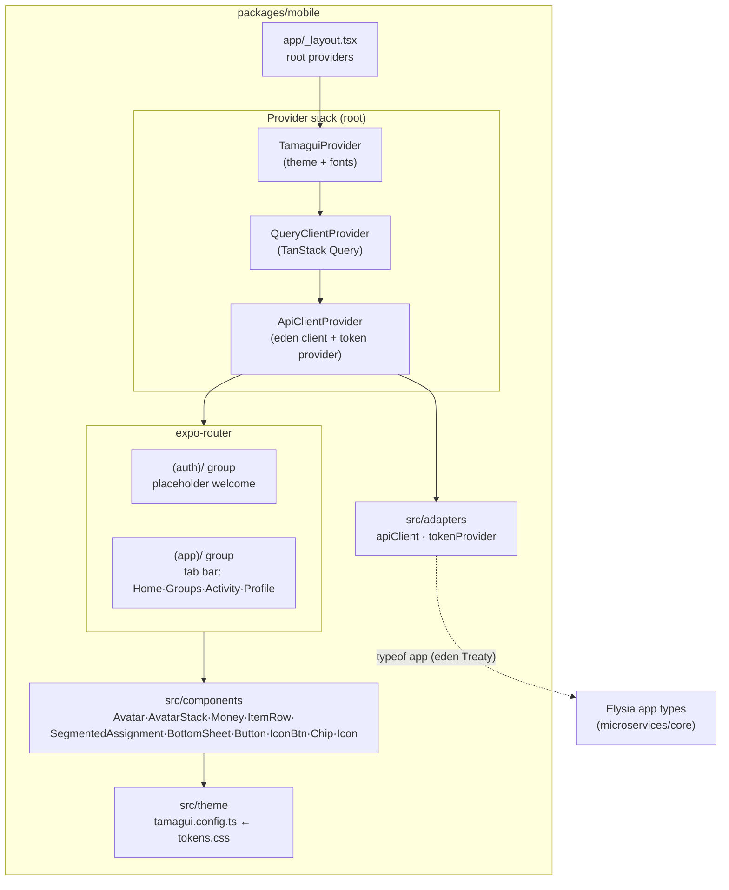

# Design — Mobile App Foundation

## Overview

This feature creates `packages/mobile`: an Expo + expo-router app that is the shell for every
later Divvy Up feature. It contributes three things and removes one:

1. **Navigation shell** — expo-router with `(auth)/` and `(app)/` layout groups and a placeholder
   bottom tab bar.
2. **Design system** — a Tamagui config generated from `~/Downloads/Divvy Up/styles/tokens.css`
   (dark-first warm indigo; semantic money `pos`/`neg`; people palette `p1…p8`; Bricolage
   Grotesque + Hanken Grotesk), plus the ported component kit from `app/ui.jsx`.
3. **Client plumbing** — a typed Eden/treaty API client adapter with an injectable token
   provider, and a TanStack Query provider, both mounted at the app root.
4. **Removal** — delete `packages/web`, `infra/web.ts`, the web output in `sst.config.ts`, and
   the web CI path filters.

No auth logic, no domain data, no money math beyond formatting. The split engine
(`packages/split-engine`) and the data layer (`packages/db`) are separate features; this
foundation only consumes their **types** indirectly through the Eden client once those exist.
Until then the client is typed against the current Elysia app export and used with placeholder
screens.

Aligns with `steering/tech.md` (Expo + expo-router + Tamagui; Eden/treaty; TanStack Query;
money in pence) and `steering/structure.md` (`packages/mobile/{app,src/theme,src/components,
src/adapters,src/features,__tests__}`; shared UI primitives live here).

## Architecture



**Provider nesting (outer → inner):** `TamaguiProvider` → `QueryClientProvider` →
`ApiClientProvider` → `<Slot/>` (expo-router). Theme is outermost so every screen and overlay
(including bottom sheets in `(app)/`) is themed; the API client sits inside Query so query
functions can read it.

**Routing:** expo-router file-based. This feature does **not** guard routes — guarding is the
`authentication` feature's job. A single default route is chosen so the app boots into a visible
placeholder.

## Components & Interfaces

### Directory layout (added)

```
packages/mobile/
├── app/                          # expo-router routes
│   ├── _layout.tsx               # root: providers + <Slot/>; loads fonts
│   ├── (auth)/
│   │   ├── _layout.tsx           # stack; placeholder
│   │   └── index.tsx             # placeholder "welcome" screen
│   └── (app)/
│       ├── _layout.tsx           # bottom Tabs
│       ├── index.tsx             # Home (placeholder)
│       ├── groups.tsx            # Groups (placeholder)
│       ├── activity.tsx          # Activity (placeholder)
│       └── profile.tsx           # Profile (placeholder)
├── src/
│   ├── theme/
│   │   ├── tokens.ts             # token values lifted from tokens.css
│   │   ├── fonts.ts              # font face config (display/body)
│   │   └── tamagui.config.ts     # createTamagui(...) export
│   ├── components/
│   │   ├── Avatar.tsx            # + AvatarStack
│   │   ├── Money.tsx
│   │   ├── ItemRow.tsx
│   │   ├── SegmentedAssignment.tsx
│   │   ├── BottomSheet.tsx
│   │   ├── Button.tsx            # Button + IconBtn
│   │   ├── Chip.tsx
│   │   ├── Icon.tsx
│   │   └── index.ts              # barrel
│   ├── adapters/
│   │   ├── apiClient.ts          # eden treaty factory + normalized errors
│   │   ├── tokenProvider.ts      # TokenProvider type + noopTokenProvider
│   │   └── ApiClientProvider.tsx # React context + provider
│   ├── query/
│   │   └── queryClient.ts        # shared QueryClient + defaults
│   └── lib/
│       └── money.ts              # formatPence(pence) -> "£x.xx"
├── __tests__/
├── tamagui.config.ts             # re-export for the Tamagui babel plugin
├── babel.config.js               # expo preset + @tamagui/babel-plugin
├── metro.config.js
├── app.json                      # Expo config (EXPO_PUBLIC_API_URL, fonts)
├── tsconfig.json
├── jest.config.js                # jest-expo preset
└── package.json                  # @divvy-up/mobile
```

### Ported component-kit mapping (`app/ui.jsx` → Tamagui)

| Prototype (`ui.jsx`)             | Ported component            | Notes for the RN port                                                                                                                                                                                             |
| -------------------------------- | --------------------------- | ----------------------------------------------------------------------------------------------------------------------------------------------------------------------------------------------------------------- |
| `Avatar({ m, size, ring, dim })` | `Avatar`                    | Placeholder member → `1.6px dashed` ring in member colour, transparent fill; real member → solid people-colour fill, white initials. `dim`, `ring` variants kept. Colour comes from `theme.p1…p8`, never hex.     |
| `AvatarStack({ ids, M, max })`   | `AvatarStack`               | Negative-margin overlap; `+N` overflow chip on `surface3`.                                                                                                                                                        |
| `Money({ pence, sign, c })`      | `Money`                     | Uses `lib/money.formatPence`; `sign` colours via `pos`/`neg` tokens; tabular figures via `fontVariant`/`fontFeatureSettings`.                                                                                     |
| `Btn({ variant, size, icon })`   | `Button`                    | Variants `brand·amber·ghost·line·pos`; sizes `lg(56)·md(46)·sm(38)`; press scale animation via Tamagui `pressStyle`/`animation`.                                                                                  |
| `IconBtn`                        | `IconBtn` (in `Button.tsx`) | Circular icon button, press scale.                                                                                                                                                                                |
| `Sheet`                          | `BottomSheet`               | Backdrop, grab handle, optional title + close `IconBtn`, scrollable body. Implemented as a themed overlay (or `@tamagui/sheet`).                                                                                  |
| `Chip`                           | `Chip`                      | Active/inactive; active fill from a colour token.                                                                                                                                                                 |
| `Icon` (svg path set)            | `Icon`                      | Ported with `react-native-svg`; carries the glyph subset used by the kit (back, chevron, close, camera, plus, check, sparkle, receipt, users, settle, home, grid, activity, user, edit, split, info, flag, mail). |
| Item row pattern (from screens)  | `ItemRow`                   | Label + `Money` amount + assignment affordance (avatar/stack or "assign" chip). Pure presentation; no assignment logic.                                                                                           |
| `One·Split·Everyone·Custom`      | `SegmentedAssignment`       | Controlled segmented control; value is one of the four modes. Selection-only — emits `onChange`, owns no split math.                                                                                              |

Components are authored with Tamagui's `styled()` and theme tokens; they accept the standard
Tamagui style props so later features can compose them.

### Navigation shell

- `app/(app)/_layout.tsx` renders an expo-router `Tabs` navigator with four placeholder tabs
  (Home/Groups/Activity/Profile), each backed by a one-line placeholder screen using themed
  text. Tab icons use the ported `Icon` set (`home`, `grid`/`users`, `activity`, `user`).
- `app/(auth)/_layout.tsx` renders a `Stack` with a single placeholder welcome screen.
- No redirect between groups; a developer toggle/placeholder link is acceptable for manual
  navigation. Guarding/redirects are out of scope (Requirement 2.6).

## Data Models

This feature defines **presentational** view-models only; no persistence, no domain entities.

```ts
// People-colour identity used by Avatar / AvatarStack (shape only — real data later)
type PeopleColorToken = "p1" | "p2" | "p3" | "p4" | "p5" | "p6" | "p7" | "p8";

interface MemberView {
  id: string;
  initials: string; // e.g. "SB"
  color: PeopleColorToken; // index into the people palette
  placeholder?: boolean; // accountless member → dashed avatar
}

// Segmented assignment selection (no split math here)
type AssignmentMode = "one" | "split" | "everyone" | "custom";

// Money is always integer pence at the boundary; formatted only at the view layer
type Pence = number;
```

`formatPence`:

```ts
// lib/money.ts
export function formatPence(pence: Pence, opts?: { sign?: boolean }): string;
// 1234 -> "£12.34"; -500 with sign -> "-£5.00"; never fractional pence.
```

## API Contract

The foundation does not add backend endpoints. It defines the **client adapter shape** and the
**token-provider interface** that the `authentication` feature plugs into.

### Eden/treaty client adapter

The client is typed against the Elysia app's exported type (`typeof app` from
`microservices/core`), matching the pattern already used by `packages/web` (`@elysiajs/eden`).
No request/response types are hand-written (per `steering/structure.md`).

```ts
// adapters/tokenProvider.ts
export type TokenProvider = () => Promise<string | null>;
export const noopTokenProvider: TokenProvider = async () => null;

// adapters/apiClient.ts
import { treaty } from "@elysiajs/eden";
import type { App } from "@divvy-up/core"; // Elysia app type export

export interface ApiClientConfig {
  // The backend has TWO API Gateways (separate hosts): coreAPI (groups/expenses/balances/…) and
  // receiptServiceAPI (capture/extract). The client builds a typed treaty per service.
  coreBaseUrl: string; // from EXPO_PUBLIC_API_URL
  receiptBaseUrl: string; // from EXPO_PUBLIC_RECEIPT_API_URL
  getToken: TokenProvider; // injected; defaults to noopTokenProvider; applied to BOTH clients
}

export interface NormalizedApiError {
  status: number; // HTTP status (0 for network/transport)
  code: string; // machine-readable code or "unknown"
  message: string; // human-readable, prod-safe
}

import type { ReceiptApp } from "@divvy-up/receipt-service"; // second Elysia app type export

export interface ApiClient {
  core: ReturnType<typeof treaty<App>>; // coreAPI host
  receipts: ReturnType<typeof treaty<ReceiptApp>>; // receiptServiceAPI host
}

export function createApiClient(config: ApiClientConfig): ApiClient;
// - builds ONE treaty per service (core → coreBaseUrl, receipts → receiptBaseUrl).
// - both share an onRequest hook that awaits getToken() and, when non-null, sets
//   `Authorization: Bearer <token>`.
// - response interpreted: non-2xx -> throw NormalizedApiError so TanStack Query
//   surfaces it as `error`.
// Feature clients pick the surface: `useApiClient().core...` or `.receipts...`.
```

```ts
// adapters/ApiClientProvider.tsx
export const ApiClientContext = createContext<ApiClient | null>(null);
export function ApiClientProvider(props: {
  getToken?: TokenProvider; // auth feature passes the real provider here
  coreBaseUrl?: string;
  receiptBaseUrl?: string;
  children: ReactNode;
}): JSX.Element; // builds the { core, receipts } client once (useMemo) and provides it
export function useApiClient(): ApiClient; // throws if used outside provider
```

**Token wiring (later, by `authentication`):** the auth feature supplies `getToken` (reading the
Supabase session from AsyncStorage) via the `ApiClientProvider` prop at the app root. No call
site changes — this feature ships with `noopTokenProvider`.

### Environment

```jsonc
// app.json -> expo.extra / EXPO_PUBLIC_*
EXPO_PUBLIC_API_URL = "<core api url>"          // coreAPI; local default e.g. http://localhost:3000
EXPO_PUBLIC_RECEIPT_API_URL = "<receipt api url>" // receiptServiceAPI (separate gateway host)
```

## Error Handling

- **Transport / non-2xx:** `createApiClient` normalizes failures to `NormalizedApiError`
  (`status`, `code`, `message`). Network failures map to `status: 0`. TanStack Query's `error`
  channel receives these; default retry applies only to transient/5xx-style failures.
- **Token provider throws/rejects:** treated as no token — the request proceeds without an
  `Authorization` header (foundation must not crash on auth-not-wired-yet).
- **Font load failure:** `expo-font` failure falls back to system font; screens still render
  (Requirement 2.5).
- **Provider misuse:** `useApiClient()` throws a clear developer error if called outside
  `ApiClientProvider`.
- **Prod-safe messages:** no stack traces or internal detail surfaced to UI; aligns with the
  global structured error handler the backend uses (`steering/tech.md` quality gates).

## Testing Strategy

Jest + React Native Testing Library via the `jest-expo` preset; unit tests for pure helpers.
Tests live in `packages/mobile/__tests__/` (per `steering/structure.md`).

| Area                  | Test                                                                                                                                                        |
| --------------------- | ----------------------------------------------------------------------------------------------------------------------------------------------------------- |
| `formatPence`         | pence→`£x.xx`, sign colours decision, no fractional pence (Req 4.4, 8.2).                                                                                   |
| `Avatar`              | renders initials; `placeholder` → dashed variant; colour sourced from people token (Req 4.1, 4.11).                                                         |
| `AvatarStack`         | overlap + `+N` overflow (Req 4.2).                                                                                                                          |
| `Money`               | formats from pence; `sign` applies `pos`/`neg` colour (Req 4.3, 4.4).                                                                                       |
| `SegmentedAssignment` | controlled selection across the four modes; emits `onChange`; holds no math (Req 4.6).                                                                      |
| `Button` / `IconBtn`  | renders each variant/size; press handler fires (Req 4.8).                                                                                                   |
| `BottomSheet`         | open renders children + title; close handler fires; closed renders nothing (Req 4.7).                                                                       |
| `Chip`                | active/inactive states (Req 4.9).                                                                                                                           |
| API adapter           | with token → request carries `Authorization: Bearer …`; with `noopTokenProvider` → no auth header; non-2xx → `NormalizedApiError` (Req 5.2, 5.3, 5.6, 8.3). |
| Root smoke            | mount `_layout` providers + a placeholder screen; renders without throwing (Req 8.4).                                                                       |
| Repo gates            | after web removal, `turbo run typecheck/lint/test:unit` green repo-wide; no `packages/web` references remain (Req 7.6, 8.5).                                |

Coverage meets the mobile threshold for code introduced by this feature (Req 8.6). Eden requests
are exercised against a mocked fetch/transport — no live backend needed at this stage.
