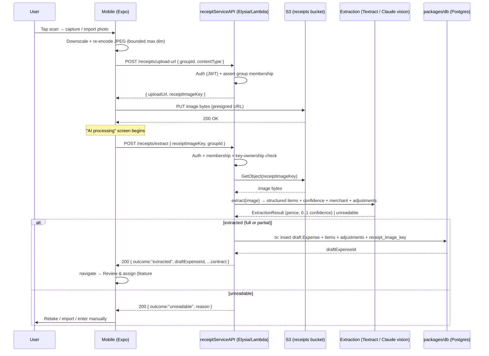

# Design — Receipt Capture & Extraction

> Feature #6 (FE → BE, one PR). Depends on foundations 1–4. Read `.kiro/steering/` first.
> The **Extraction Contract** (§Data Models / §API Contract) is the load-bearing artifact:
> feature #7 (`receipt-review-assignment`) consumes it verbatim.

## Overview

The feature takes a user from "I have a receipt in front of me" to "an editable draft expense
exists, populated by AI". Three moving parts:

1. **Mobile capture + processing** (`packages/mobile`): camera, photo-library import, an upload
   step with honest progress, and the AI-processing screen. Built first against a **typed mock
   extract client** so the UI is complete and testable before any backend exists.
2. **Storage + upload path** (`infra/storage.ts` + a presign endpoint): an S3 bucket for receipt
   images and a presigned-PUT path (API-proxied upload is the fallback) so the device never holds
   AWS credentials.
3. **Real extraction + persistence** (`microservices/other-service`): replaces the mock OCR with
   real vision/OCR (AWS Textract **or** Claude vision) returning the structured contract — items
   in **integer pence with per-item confidence**, merchant, adjustments — then persists a **draft
   expense + items + `receipt_image_key`** via `packages/db`.

This feature **ends** by handing the persisted draft id to the Review entry point. It does not
own Review, assignment, the "how AI read your receipt" overlay, finalize, or manual add-expense.

### Reconciling existing code

The current `microservices/other-service` extract handler (`POST /receipts/extract`) is a
**mock** returning `OcrExtractResult` in **USD cents** with flat `tax`/`tip` and **no
confidence**. This feature rewrites that contract:

- USD/cents → **GBP/pence**, field names `*Minor` to make minor-units explicit.
- flat `tax`/`tip` numbers → an **`adjustments[]`** array (`service`/`tip`/`tax`/`discount`).
- add **per-item `confidence` + `flagReason`** (the prototype's `conf` / `flag`).
- add a **typed outcome** (`extracted` | `unreadable`) so failure degrades honestly.
- the handler now **persists a draft** and returns its id, not just an OCR blob.

The existing handler test (`receiptExtractHandler.test.ts`) is rewritten against the new contract.

## Architecture



API-proxied upload fallback (no presign): the device POSTs bytes to
`POST /receipts/upload` (multipart), the Lambda streams to S3 and returns `receiptImageKey`.
The presigned-PUT path is preferred (keeps large bytes off Lambda); the contract for `/extract`
is identical either way.

## Components & Interfaces

### Mobile (`packages/mobile/src/features/receipt-capture/`)

| Component            | Responsibility                                                                                                                                                                                                                                                                             |
| -------------------- | ------------------------------------------------------------------------------------------------------------------------------------------------------------------------------------------------------------------------------------------------------------------------------------------ |
| `CameraScreen`       | `expo-camera` viewfinder, framing guidance, torch toggle, capture button, library button. Handles camera permission states (Req 1.2). On capture → `useReceiptUpload`. Ports prototype `CameraScreen`.                                                                                     |
| `useImagePicker`     | Wraps `expo-image-picker` for library import (Req 2). Validates type/size; returns a normalized local URI.                                                                                                                                                                                 |
| `prepareImage`       | Shared util: downscale to bounded max dimension + JPEG re-encode (`expo-image-manipulator`) so capture and import share one pipeline (Req 1.5 / 2.5).                                                                                                                                      |
| `useReceiptUpload`   | Orchestrates: presign → PUT to S3 with progress + cancel (Req 3); exposes `progress`, `error`, `retry`. Falls back to API-proxied upload if presign is disabled.                                                                                                                           |
| `ProcessingScreen`   | "AI processing" screen. Drives the extract call, shows honest progress steps + the "You'll confirm everything before it's saved" reassurance, handles timeout/retry (Req 4). Ports prototype `ProcessingScreen`. On success → navigate to Review with `draftExpenseId`.                    |
| `ReceiptCaptureFlow` | expo-router stack tying Camera → Upload → Processing; owns navigation and the `unreadable` branch (retake / import / manual).                                                                                                                                                              |
| `extractClient`      | Typed client for `/receipts/upload-url` + `/receipts/extract`. **Two implementations behind one interface**: `mockExtractClient` (built first; serves fixtures incl. low-confidence + unreadable) and the real eden client. Swapped at the adapter layer (`packages/mobile/src/adapters`). |

Permission and error states reuse shared primitives from `mobile-app-foundation`. The
processing-step copy is driven by the response, not hardcoded promises (Req 4.2).

### Backend (`microservices/other-service/src`)

Layering matches `microservices/core` (handler thin → service → repositories), per
`steering/structure.md`.

| Unit                             | Responsibility                                                                                                                                                                                                                                    |
| -------------------------------- | ------------------------------------------------------------------------------------------------------------------------------------------------------------------------------------------------------------------------------------------------- |
| `receiptUploadHandler`           | `POST /receipts/upload-url` (and the `/receipts/upload` proxy fallback). Validates body, asserts group membership, mints the S3 key + presigned PUT URL via `ReceiptStorageRepository`.                                                           |
| `receiptExtractHandler`          | `POST /receipts/extract` (rewritten). Validates body, asserts membership + key ownership, calls `ReceiptExtractService`, maps `Result` → HTTP.                                                                                                    |
| `ReceiptExtractService`          | Domain orchestration: fetch object → call `ExtractionProvider` → normalize to the contract (pence, clamp confidence to `0..1`, compute `subtotalMinor`/`reconciled`) → persist draft in one tx → return contract + `draftExpenseId`.              |
| `ExtractionProvider` (interface) | `extract(image: Bytes, hint): Promise<Result<RawExtraction, ExtractError>>`. Two impls: `TextractExtractionProvider` **or** `ClaudeVisionExtractionProvider` (chosen by config/secret), plus `FixtureExtractionProvider` for deterministic tests. |
| `ReceiptStorageRepository`       | S3 access: presign PUT, `getObject(key)`, key minting/validation (`receipts/{userId}/{groupId}/{uuid}.jpg`). Wraps the `infra/storage.ts` bucket binding.                                                                                         |
| `DraftExpenseRepository`         | Persists draft expense + items + adjustments via `packages/db` in a transaction; scoped to user + group (Req 7). Owned conceptually by `data-and-persistence`; this feature adds the draft-from-extraction write path.                            |

`ExtractionProvider` is the seam that keeps vision deterministic in tests (see Testing Strategy)
and lets Textract vs Claude vision be swapped without touching the handler or the contract.

## Data Models

### Extraction Contract (the FE↔BE bridge — feature #7 consumes this)

All money is **integer pence**. Field names carry `Minor` to make that unmissable.

```ts
// microservices/other-service/src/types/receipt.ts  (rewrites the existing USD/cents shape)

export type Currency = "GBP"; // V1 fixed; field retained for future multi-currency

export type AdjustmentKind = "service" | "tip" | "tax" | "discount";

export interface ExtractedItem {
  /** Stable id assigned at persistence (echoed back so #7 can reference it). */
  id: string;
  description: string;
  quantity: number; // integer ≥ 1
  unitPriceMinor: number; // integer pence ≥ 0
  lineTotalMinor: number; // integer pence ≥ 0  (== unitPriceMinor * quantity unless the receipt prints otherwise)
  confidence: number; // 0..1
  /** Present iff the model is unsure; drives the amber "check this" flag in #7. */
  flagReason: string | null;
  // NOTE: no assignment field — assignment is owned by feature #7.
}

export interface ExtractedAdjustment {
  id: string;
  kind: AdjustmentKind;
  label: string; // e.g. "Service charge 12.5%"
  amountMinor: number; // integer pence; NEGATIVE for discounts
  confidence: number; // 0..1
}

export interface ExtractionResult {
  outcome: "extracted";
  /** Persisted draft this extraction created; client navigates straight into Review. */
  draftExpenseId: string;
  groupId: string;
  receiptImageKey: string;
  currency: Currency; // "GBP"
  merchant: string | null; // null, never fabricated (Req 5.4)
  date: string | null; // ISO yyyy-mm-dd if read, else null
  items: ExtractedItem[]; // unassigned
  adjustments: ExtractedAdjustment[];
  subtotalMinor: number; // sum of lineTotalMinor
  adjustmentsTotalMinor: number; // sum of adjustment amountMinor (discounts negative)
  totalMinor: number; // as printed on the receipt
  /** false when subtotal + adjustments != printed total (Req 5.7); amounts left untouched. */
  reconciled: boolean;
  /** true when some lines could not be read but others could (Req 6.3). */
  partial: boolean;
  /** mean item confidence; lets #7 lead with a "please check these" state (Req 6.4). */
  overallConfidence: number; // 0..1
}

export interface UnreadableResult {
  outcome: "unreadable";
  receiptImageKey: string;
  groupId: string;
  reason: string; // human-readable, e.g. "This doesn't look like a receipt"
}

export type ExtractResponse = ExtractionResult | UnreadableResult;
```

### Persistence (reference: `data-and-persistence` schema)

This feature **does not invent** tables — it writes into the canonical schema owned by spec #2
(`data-and-persistence`) and the pence-based domain types in `microservices/core`. The shapes it
relies on, contributed back to that schema:

- `expenses` — adds/uses `status` (`draft` | `finalized`), `currency` (`'GBP'`), `merchant`,
  `subtotal_minor`, `adjustments_total_minor`, `total_minor`, **`receipt_image_key`**, `group_id`,
  `payer_id`, `reconciled`.
- `receipt_items` — `id`, `expense_id`, `description`, `quantity`, `unit_price_minor`,
  `line_total_minor`, `confidence` (real), `flag_reason` (nullable text), `position` (order);
  assignment columns exist in the schema but are left **null** here (filled by #7).
- `receipt_adjustments` — `id`, `expense_id`, `kind`, `label`, `amount_minor` (signed),
  `confidence`.

Mapping note: the prototype's `item.conf` → `confidence`, `item.flag` → `flag_reason`,
`item.price` (pence) → `unit_price_minor`, `item.qty` → `quantity`; the prototype's
`adjustments[]` (`{kind, mode:'percent'|'fixed', value}`) is **resolved to integer pence
`amount_minor`** at extraction time so storage and the split engine never deal in percentages.

## API Contract

Both endpoints live on `receiptServiceAPI` (`infra/api.ts`) and are exported through the Elysia
app so the mobile **eden/treaty** client gets them typed end-to-end (no hand-written duplicate
types — per `steering/structure.md`). Both require a valid JWT (auth middleware from spec #4) and
assert group membership.

### `POST /receipts/upload-url`

```ts
// Request
{
  groupId: string;
  contentType: "image/jpeg";
} // jpeg after client re-encode
// Response 200
{
  uploadUrl: string; // presigned S3 PUT, short TTL
  receiptImageKey: string; // receipts/{userId}/{groupId}/{uuid}.jpg
  method: "PUT";
  headers: Record<string, string>;
}
// Errors: 401 unauth · 403 not a group member · 400 bad contentType
```

Fallback (presign disabled): `POST /receipts/upload` multipart `{ groupId, file }` →
`{ receiptImageKey }`.

### `POST /receipts/extract`

```ts
// Request
{
  receiptImageKey: string;
  groupId: string;
}
// Response 200  →  ExtractResponse  (ExtractionResult | UnreadableResult)
// Errors:
//   401 unauthenticated
//   403 not a group member, or key not owned by this user/group
//   404 receiptImageKey has no S3 object
//   422 image fetched but provider could not process it as an image
//   504 extraction provider timed out (client offers retry / manual)
```

Elysia `t.Object` schemas mirror the types above; the union response uses
`t.Union([ExtractionResultSchema, UnreadableResultSchema])` discriminated on `outcome` so the
eden client narrows correctly. Monetary fields validate as integers (`t.Integer()` / multipleOf 1).

## Error Handling

| Failure                                   | Where                                  | Behavior                                                                                 |
| ----------------------------------------- | -------------------------------------- | ---------------------------------------------------------------------------------------- |
| Camera/library permission denied          | Mobile                                 | Explanatory state + settings link + import alternative; never a dead end (Req 1.2, 2.2). |
| Unsupported / oversized image             | Mobile + `upload-url` 400              | Reject with clear message, let the user pick again (Req 2.4).                            |
| Upload network error / timeout            | `useReceiptUpload`                     | Retry affordance + cancel; do not call `/extract` (Req 3.4).                             |
| `receiptImageKey` not owned by user/group | `/extract` 403                         | Reject; persist nothing (Req 3.6, 7.6).                                                  |
| S3 object missing                         | `/extract` 404                         | Reject; client re-uploads.                                                               |
| Provider can't read it as a receipt       | service → `outcome:"unreadable"` (200) | Honest `unreadable` payload + reason; **no fabricated items, no draft** (Req 6.1, 6.2).  |
| Partial read                              | service → `partial:true`               | Return read items with low `confidence`/`flagReason`; persist what was read (Req 6.3).   |
| Subtotal+adjustments ≠ printed total      | service → `reconciled:false`           | Return as-read; never silently adjust amounts (Req 5.7).                                 |
| Extraction provider timeout               | `/extract` 504                         | Client stops spinner, offers retry / manual (Req 4.5).                                   |
| Persistence fails post-extract            | `/extract` 5xx                         | One transaction → no partial draft; client may retry (Req 7.7).                          |

All amounts are clamped/validated to integer pence and confidence to `0..1` in the service before
persistence — a misbehaving provider can never write a fractional pence or out-of-range
confidence. Errors flow through the global structured error handler (request-id correlation) per
`steering/tech.md`.

## Testing Strategy

**Unit / contract (Vitest, backend):**

- `ReceiptExtractService` normalization: pence clamping, confidence clamping to `0..1`,
  `subtotalMinor` computation, `reconciled` flag when sums mismatch, `overallConfidence` mean.
- Contract shape: every monetary field is an integer; discounts are negative; items have no
  assignment field; `unreadable` carries no items.
- Membership / key-ownership guards return 403 and persist nothing.
- Persistence is one transaction (inject a failing repo → assert no draft rows written).

**Deterministic vision testing — the key technique:** the `ExtractionProvider` interface lets
tests inject a `FixtureExtractionProvider` so no real model is called. **Fixture receipts** live
in `microservices/other-service/src/application/receipt/extract/__tests__/fixtures/`:
each fixture is a `{ image (small jpeg/png), expected: RawExtraction }` pair covering —
clean restaurant receipt (high confidence), café with service charge (adjustment + tip),
**low-confidence item** (ambiguous quantity → `confidence < 0.7` + `flagReason`, mirrors the
prototype's "Espresso"), **unreadable item** (handwriting unclear, mirrors "Affogato"), a
**fully unreadable** image (→ `outcome:"unreadable"`), and a **non-reconciling** total. Service
tests assert the normalized contract for each fixture exactly.

For the **real providers**, a small opt-in integration suite (gated behind an env flag / secret,
not run in default CI) sends the same fixture images to Textract / Claude vision and asserts the
_shape and tolerances_ (item count within range, totals within a pence tolerance, confidence in
range) rather than exact strings — keeping the default suite hermetic and deterministic.

**Mobile (Jest + RN Testing Library):**

- Capture screen: permission-granted, permission-denied (import fallback shown), torch toggle,
  capture → advances.
- Import: picks an image, rejects unsupported type/oversize.
- Upload hook: progress, cancel, retry on failure, does not extract on upload failure.
- Processing screen against `mockExtractClient`: success → navigates with `draftExpenseId`;
  `unreadable` → shows retake/manual; timeout → stops spinner + retry. Snapshot the honest
  progress copy.

**Integration / wire-up (end of the PR):** swap `mockExtractClient` for the real eden client;
run the capture → upload → extract → draft-persisted path against the deployed
`receiptServiceAPI` with `FixtureExtractionProvider` enabled, asserting a `draft` expense + items

- `receipt_image_key` land in `packages/db`. Coverage meets the repo bar (Vitest 90% per
  `steering/tech.md`).
