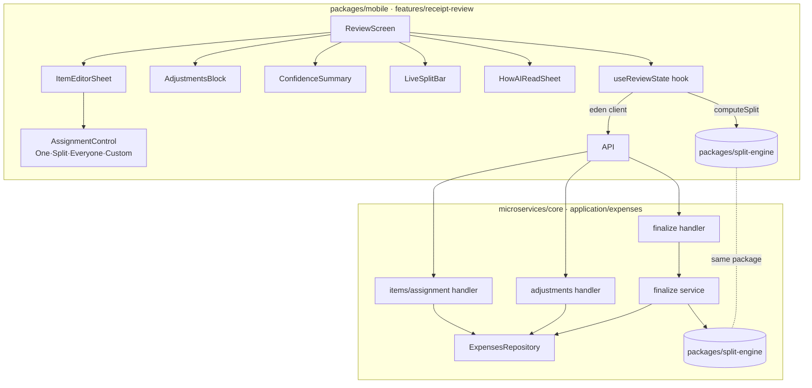

# Design — Receipt Review & Assignment (feature #7)

## Overview

The Review & assign flow is the product hero. A draft `Expense` (created by capture/extraction,
feature #6, or manual entry) is presented as an editable list; the user confirms every item's
assignment, sees a live, fully-explainable split, and finalizes. Finalize flips the expense
`draft → finalized` and computes per-member balances.

All split math — per-item shares, pro-rata adjustment apportionment, largest-remainder rounding —
lives in **`packages/split-engine`** (feature #3). Both the mobile live preview and the backend
finalize call the **same** engine; this feature adds no math of its own. Money is integer pence
everywhere; formatting to `£x.xx` happens only at the view layer. Manual entry reuses this exact
Review screen and Item editor — there is no separate manual editor.

Delivery is frontend-first in one PR: build the screens against a typed mock of the eden client,
then implement the backend endpoints, then wire the real client and add integration tests.

### Contract reconciliation (read first)

The scaffolded domain type and `PUT .../assignment` handler currently model custom splits as
`shares: [{ memberId, fraction: number }]` (float fractions). The locked technical decision
(`steering/tech.md`) and the split engine require **integer share weights**. This feature adopts
`shares: [{ memberId, weight: number /* integer ≥ 0 */ }]` as the canonical wire + storage shape,
and updates the existing assignment handler schema and `computeBalances` accordingly. The float
`fraction` field is removed (it is unreleased scaffold). The split-engine's `computeSplit` consumes
these integer weights directly via `splitPence(amount, weights)`.

---

## Architecture



- **Mobile** owns all UX state in a `useReviewState` hook: the working copy of items + adjustments,
  derived flagged/unassigned counts, and the live `computeSplit` result. Edits optimistically update
  local state and persist through the eden client.
- **Backend** stays thin per existing layering: handlers validate → call the repository/service →
  map result/error. Finalize is the only handler with domain logic, delegated to the split engine.

---

## Components & Interfaces

### Mobile — `packages/mobile/src/features/receipt-review/`

- **`ReviewScreen`** — header ("you paid" + total + merchant + date), AI-filled reveal toast,
  `ConfidenceSummary`, the scrollable `ItemRow` list (tinted by assigned person colour), the
  `AdjustmentsBlock`, the `LiveSplitBar` footer, and the receipt-thumbnail button that opens
  `HowAIReadSheet`. Holds a ref list of rows so the summary can scroll-to-first-flagged.
  _Requirements: 1, 3, 4, 5, 6, 9_
- **`ItemRow`** — description / qty / line amount / assignment badge; amber left-accent + "check this"
  when flagged or unassigned; opens `ItemEditorSheet` on tap. _Requirements: 1.2, 1.3, 3.2_
- **`ItemEditorSheet`** (bottom sheet) — name/qty/price (pence) steppers for manual/edited items,
  the `AssignmentControl`, a per-mode explanatory caption, and a member picker. Save emits a typed
  `ItemAssignment`. _Requirements: 2, 5_
- **`AssignmentControl`** — segmented `One · Split · Everyone · Custom`. One = single-select member;
  Split = multi-select; Everyone = no picker; Custom = integer **share steppers** (default 1 each,
  e.g. 2 : 1). Emits the discriminated-union assignment. _Requirements: 2.1–2.6_
- **`ConfidenceSummary`** — "N items need a quick check" banner; tap scrolls to and opens the first
  flagged/unassigned item; hidden when count is 0. _Requirements: 3_
- **`AdjustmentsBlock`** — lists adjustments with label + resolved pence, a "split pro-rata" chip and
  footnote; add/edit/remove triggers persistence + recompute. _Requirements: 4_
- **`LiveSplitBar`** — per-person amounts (£x.xx, colour-coded), unassigned amount (amber), total,
  and the Confirm & save button (disabled while unassigned). _Requirements: 5, 6_
- **`HowAIReadSheet`** — read-only list of extracted lines tinted by assignee colour (everyone = ★,
  unassigned/low-conf = amber) + legend. _Requirements: 9_
- **`useReviewState`** — single source of UI truth: working items/adjustments, `computeSplit`
  result, `flaggedCount`, `unassignedPence`, `canFinalize`; methods `setAssignment`, `setAdjustments`,
  `addItem`, `finalize`. Calls `packages/split-engine` synchronously and the eden client for writes.
  _Requirements: 5, 6, 7, 8_

### Backend — `microservices/core/src/application/expenses/`

- **`items/assignment` handler** (`PUT /expenses/:id/items/:itemId/assignment`) — existing; update
  the `custom` schema to integer `weight`, add group-membership scoping + a `finalized`-status guard.
  _Requirements: 2, 7_
- **`adjustments` handler** (`PUT /expenses/:id/adjustments`) — **new**; replaces the draft's full
  adjustments array; same scoping + status guard. _Requirements: 4, 7_
- **`finalize` handler + service** (`POST /expenses/:id/finalize`) — existing; reject unassigned
  items (validation), compute balances via the split engine (pro-rata adjustments, `everyone`
  resolution), persist status + balances, idempotent if already finalized. _Requirements: 6, 8_
- **`ExpensesRepository`** — add `updateAdjustments`, ownership/scoping checks, and a `finalized`
  guard; persist computed balances on finalize. _Requirements: 7, 8_

---

## Data Models

This feature defines **no new persisted entities**. It references the canonical types:

- **`Expense`, `ReceiptItem`, `ReceiptAdjustment`, `ItemAssignment`, `Balance`, `ExpenseStatus`** —
  owned by `data-and-persistence` (feature #2) and the `domain/types.ts` already in `core`. The only
  change is the `custom` assignment shape (see Contract reconciliation): `shares: { memberId, weight }[]`.
- **Split inputs/outputs** (`computeSplit` args + the `{ perPerson, adjByPerson, unassigned,
itemsSubtotal, assignedSubtotal, adjustmentsTotal, total, sharesByItem, flagged }` result) — owned
  and exported by **`packages/split-engine`** (feature #3). This feature imports those types; it does
  not redefine them.
- **Per-item confidence** (`confidence` + `flagReason`) — part of the extraction contract
  (feature #6); consumed read-only here to drive flags.

Shared FE/BE types flow through the Elysia app's exported types (eden) and `packages/db`
schema-inferred types — no duplicate hand-written definitions.

---

## API Contract

All endpoints scoped to the authenticated user's group memberships; responses are typed and consumed
via the eden/treaty client (`packages/mobile/src/adapters`).

```ts
// Canonical assignment shape (integer weights for custom)
type ItemAssignment =
  | { type: "one"; memberId: string }
  | { type: "equal"; memberIds: string[] }
  | { type: "everyone" }
  | { type: "custom"; shares: { memberId: string; weight: number }[] };
```

**1. Update item assignment**
`PUT /expenses/:id/items/:itemId/assignment`
Body: `{ assignment: ItemAssignment }`
→ `200 Expense` · `403 { error }` (not a group member) · `404 { error }` (no expense/item) ·
`409 { error }` (expense finalized).

**2. Update adjustments** _(new)_
`PUT /expenses/:id/adjustments`
Body: `{ adjustments: { kind: "tax"|"tip"|"discount"; amount: number /*pence*/; isPercent: boolean }[] }`
→ `200 Expense` · `403` · `404` · `409` (finalized).

**3. Finalize**
`POST /expenses/:id/finalize`
Body: `{ memberIds: string[] /* full group member list, resolves "everyone" */ }`
→ `200 { expense: Expense; balances: Balance[] }` · `403` · `404` ·
`422 { error, unassignedItemIds: string[] }` (items still unassigned).
Idempotent: re-finalizing a finalized expense returns the same `{ expense, balances }`.

---

## Error Handling

- **Unassigned-on-finalize** → `422` with `unassignedItemIds`; status unchanged. The client should
  not normally reach this (button is disabled) but the backend enforces it as the authority.
- **Finalized-write** (assignment/adjustment edits after finalize) → `409`; no mutation.
- **Not found** (expense/item) → `404`; no mutation.
- **Not a group member** → `403` (or `404` to avoid existence leakage, per `core` convention);
  no mutation.
- **Optimistic-update rollback** — mobile applies edits locally, then persists; on a non-2xx the
  hook rolls back to the last server-confirmed state and surfaces a non-blocking error toast.
- All backend errors flow through `core`'s global structured error handler (request-id correlation,
  prod-safe stack traces). Money is validated as integer pence; non-integer amounts are rejected.

---

## Testing Strategy

Rely on `packages/split-engine`'s own unit tests for the split math (exact-sum rounding, pro-rata
apportionment, custom integer weights). This feature tests the **UI states** and the **finalize/
persistence wiring**, not the arithmetic.

**Mobile (Jest + RN Testing Library)** — against a typed mock of the eden client:

- `AssignmentControl`: each mode emits the correct discriminated-union value; Custom defaults to
  weight 1 and produces integer 2:1 weights via the steppers. _R2_
- `ReviewScreen`: rows tint by assignee colour; AI-filled toast shows for AI drafts, hidden for
  manual. _R1_
- `ConfidenceSummary`: count matches flagged+unassigned; tap focuses the first; hides at 0;
  decrements on clear. _R3_
- `AdjustmentsBlock`: pro-rata chip + footnote render; discount shows negative. _R4_
- `LiveSplitBar`/`useReviewState`: preview updates on assignment/adjustment change; per-person sum
  equals total (asserted using the real engine); unassigned amount surfaced. _R5_
- Confirm button: disabled while unassigned, enabled + relabelled when complete. _R6_
- `HowAIReadSheet`: lines tinted by assignee, everyone = ★, unassigned = amber; read-only. _R9_

**Backend (Vitest)** — extend existing handler tests:

- Assignment handler: persists each mode incl. custom integer weights; `403` non-member; `404`
  missing; `409` finalized. _R2, R7_
- Adjustments handler: replaces array, recompute-ready; scoping + status guards. _R4, R7_
- Finalize handler: `422` + `unassignedItemIds` when unassigned (status unchanged); `200` flips to
  finalized and returns balances; payer excluded; balances computed via the engine; idempotent on
  re-finalize. _R6, R8_

**Integration (wire-up)** — drive the mobile hook against the real `core` app: assign all items →
adjustments persist → finalize returns balances whose per-person sum equals the receipt total.
_R5, R7, R8_

Meet the repo coverage bar (Vitest v8 / mobile Jest thresholds); typecheck, lint, prettier green.
