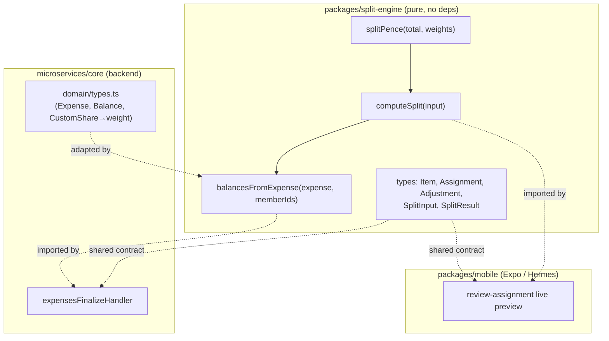

# Design — Shared Split Engine (`packages/split-engine`)

## Overview

`packages/split-engine` is a tiny, framework-free, fully-typed TypeScript package that owns **all**
of Divvy Up's split math. It is a faithful port of the prototype's `~/Downloads/Divvy Up/app/
compute.jsx` (`splitPence` + `computeSplit`), plus one new adapter (`balancesFromExpense`) that
maps a finalized `Expense` onto the engine and returns per-payer `Balance` rows.

Money is integer **pence** end to end. The engine's defining property is the **exact-sum
invariant**: the per-person shares it returns always reconstruct the input total, achieved with
**largest-remainder rounding**. It is consumed unchanged by both the backend finalize path
(`microservices/core`) and the mobile live-review preview (`packages/mobile`), guaranteeing the
preview a user sees and the balance the backend saves agree to the penny.

This package depends on **nothing** at runtime. It is the only place split math may live.

## Architecture



**Layering rule:** `splitPence` is the rounding primitive; `computeSplit` is the pure engine over
generic items/adjustments; `balancesFromExpense` is the _only_ part that knows about the
`microservices/core` domain (`Expense`, `Balance`) and adapts it to/from the engine. The mobile
app calls `computeSplit` directly with its own in-memory review state. Neither consumer reimplements
any arithmetic.

### Package layout

```
packages/split-engine/
├── package.json            # name "@divvy-up/split-engine", type module, main → dist or src
├── tsconfig.json           # extends repo base; declaration: true
├── vitest.config.ts        # v8 coverage, thresholds per steering (90%)
└── src/
    ├── index.ts            # public re-exports (functions + types)
    ├── types.ts            # Item, Assignment, Adjustment, SplitInput, SplitResult, MemberId
    ├── splitPence.ts       # splitPence
    ├── computeSplit.ts     # computeSplit
    ├── balancesFromExpense.ts  # Expense → Balance[] adapter (new)
    └── __tests__/
        ├── splitPence.test.ts
        ├── computeSplit.test.ts
        ├── invariants.property.test.ts
        └── balancesFromExpense.test.ts
```

## Components & Interfaces

### `splitPence`

```ts
/**
 * Split `total` pence across integer `weights` so the result sums EXACTLY to `total`,
 * using largest-remainder rounding. Pure & deterministic.
 *
 * - sum(weights) <= 0  → array of zeros (same length as weights).
 * - Works for negative `total` (discount distribution).
 * - Ties on fractional remainder broken by ascending index.
 */
export function splitPence(total: number, weights: number[]): number[];
```

### `computeSplit`

```ts
export function computeSplit(input: SplitInput): SplitResult;

// where:
export interface SplitInput {
  items: Item[];
  adjustments: Adjustment[];
  memberIds: MemberId[];
}
```

### `balancesFromExpense` (new — replaces `computeBalances`)

```ts
import type { Expense, Balance, MemberId } from "microservices/core domain";

/**
 * Derive per-payer balances from a finalized expense using the shared engine.
 * Returns one Balance per NON-payer member with a non-zero net (item shares +
 * pro-rata adjustments). `toMemberId` is always expense.payerId.
 *
 * `memberIds` resolves `everyone` assignments; pass the group's full member list.
 */
export function balancesFromExpense(
  expense: Expense,
  memberIds: MemberId[],
): Balance[];
```

`balancesFromExpense` adapts `Expense` → `SplitInput`:

- `items`: `{ id, price: unitPrice, qty: quantity, assign, conf? }` where `assign` maps the domain
  `ItemAssignment` to the engine `Assignment` (see Data Models).
- `adjustments`: `{ kind, mode: isPercent ? "percent" : "fixed", value: amount }`. `amount` is the
  schema value verbatim — **basis points when `isPercent`** (e.g. `1250`), pence otherwise; no
  conversion (the engine consumes bps directly).
- `memberIds`: passed through, used both for `everyone` resolution and as the canonical member set.

Then it runs `computeSplit`, drops the payer, and emits `Balance` rows for non-payers whose
`perPerson` value is non-zero.

## Data Models

The engine's own types are deliberately close to the prototype's runtime shapes (so the port is
literal) but fully typed.

```ts
export type MemberId = string;

export type AssignMode = "one" | "equal" | "everyone" | "custom";

export type Assignment =
  | { mode: "one"; who: [MemberId] } // exactly one target
  | { mode: "equal"; who: MemberId[] } // equal weights across `who`
  | { mode: "everyone" } // resolved against memberIds
  | { mode: "custom"; shares: Record<MemberId, number> }; // INTEGER weights, e.g. {a:2, b:1}

export interface Item {
  id: string;
  price: number; // unit price in pence
  qty?: number; // defaults to 1
  assign?: Assignment | null;
  conf?: number; // optional AI confidence 0..1
}

export type AdjustmentKind = "tax" | "tip" | "discount";
export type AdjustmentMode = "fixed" | "percent";

export interface Adjustment {
  kind: AdjustmentKind;
  mode: AdjustmentMode;
  value: number; // fixed → pence; percent → basis points (1250 = 12.50%). discounts negative.
}

export interface SplitResult {
  perPerson: Record<MemberId, number>; // final pence per member (items + adjustments)
  adjByPerson: Record<MemberId, number>; // adjustment pence per member (signed)
  sharesByItem: Record<string, Record<MemberId, number>>; // explainability, per line
  unassigned: number; // pence of items with no/empty assignment
  itemsSubtotal: number; // sum of all item amounts
  assignedSubtotal: number; // itemsSubtotal - unassigned
  adjustmentsTotal: number; // signed sum of adjustment amounts
  total: number; // itemsSubtotal + adjustmentsTotal
  flagged: number; // count of items with conf != null && conf < 0.7
}
```

### Relationship to `microservices/core` domain types

`balancesFromExpense` is the bridge; the domain types (`Expense`, `ReceiptItem`,
`ItemAssignment`, `ReceiptAdjustment`, `Balance`) stay in `microservices/core/src/domain/types.ts`.
Two domain changes land with this feature (per `steering/tech.md`):

- `CustomShare.fraction: number` (float) → `CustomShare.weight: number` (**integer**). The adapter
  maps `shares: CustomShare[]` → `{ [memberId]: weight }`.
- `Expense.currency` default `"USD"` → `"GBP"`.

Mapping table used by `balancesFromExpense`:

| Domain `ItemAssignment`                          | Engine `Assignment`                        |
| ------------------------------------------------ | ------------------------------------------ |
| `{ type: "one", memberId }`                      | `{ mode: "one", who: [memberId] }`         |
| `{ type: "equal", memberIds }`                   | `{ mode: "equal", who: memberIds }`        |
| `{ type: "everyone" }`                           | `{ mode: "everyone" }`                     |
| `{ type: "custom", shares: [{memberId,weight}]}` | `{ mode: "custom", shares: {id: weight} }` |

| Domain `ReceiptAdjustment`           | Engine `Adjustment`                        |
| ------------------------------------ | ------------------------------------------ |
| `{ kind, amount, isPercent: true }`  | `{ kind, mode: "percent", value: amount }` |
| `{ kind, amount, isPercent: false }` | `{ kind, mode: "fixed", value: amount }`   |

`amount` is passed through **unchanged** — it is basis points when `isPercent` (schema stores
`1250` for 12.50%) and pence otherwise. The engine never rescales it; see the percent formula
below (`× bps / 10000`). This keeps a single integer unit end-to-end (schema → wire → engine) and
removes any ×100 conversion step.

## Algorithm

### Largest-remainder rounding (`splitPence`)

Goal: split `total` pence by integer weights so shares are integers that sum to exactly `total`.

1. `sum = Σ weights`. If `sum <= 0`, return all zeros.
2. `raw[i] = total * weights[i] / sum` (real number).
3. `floor[i] = Math.floor(raw[i])`. Each share gets at least its floor.
4. `rem = total - Σ floor` — the leftover pennies that floors couldn't place (`0 ≤ rem < length`
   for positive totals).
5. Order indices by descending fractional remainder `(raw[i] - floor[i])`; ties broken by
   ascending index (stable, deterministic).
6. Hand one extra penny to each of the first `rem` indices in that order.

This guarantees `Σ out === total` exactly, with the leftover pennies going to whoever was "closest"
to rounding up — fair and reproducible.

#### Worked pence example

Split **£10.00 = 1000p** equally across 3 people (`weights = [1,1,1]`):

- `sum = 3`, `raw = [333.33…, 333.33…, 333.33…]`, `floor = [333, 333, 333]`.
- `rem = 1000 - 999 = 1` penny left.
- Remainders all equal `0.333…` → tie → ascending index → index 0 first.
- `out = [334, 333, 333]`, which sums to **1000**. No penny lost.

Contrast with the old `computeBalances`: `Math.round(1000 * 1/3)` per person = `333 + 333 + 333 =
999` — a lost penny. That is the bug this engine fixes.

A weighted custom example — split **1000p** by `2 : 1` (`weights = [2,1]`):

- `sum = 3`, `raw = [666.66…, 333.33…]`, `floor = [666, 333]`, `rem = 1`.
- Remainders `0.66…` vs `0.33…` → index 0 wins the penny → `out = [667, 333]` → sums to 1000.

### Pro-rata adjustments (`computeSplit`)

After all items are distributed into `perPerson`:

1. For each adjustment, resolve its signed pence amount:
   - `percent`: `amt = Math.round(itemsSubtotal * value / 10000)` — `value` is **basis points**, so
     `/ 10000` (not `/ 100`); computed **on the items subtotal**.
   - `fixed`: `amt = value` — already pence.
   - `discount` kind: `amt = -Math.abs(amt)`.
   - accumulate into `adjustmentsTotal`.
2. Build the pro-rata weight vector: the members who currently hold a positive share, weighted by
   that share. If nobody holds a positive share, fall back to equal weights over all `memberIds`.
3. `parts = splitPence(amt, weights)` — so even the adjustment splits to the exact penny.
4. Add each part into `adjByPerson`, and finally fold `adjByPerson` into `perPerson`.

#### Worked pence example — pro-rata service charge

Receipt: A's items = 600p, B's items = 400p (`itemsSubtotal = 1000`, fully assigned). Add a
**12.5% service charge** (`percent`, value `1250` basis points — as stored in the schema):

- `amt = round(1000 * 1250 / 10000) = round(125) = 125p`.
- Weights = current shares `[600, 400]` (A, B).
- `splitPence(125, [600, 400])`: `raw = [75, 50]`, `floor = [75, 50]`, `rem = 0` → `[75, 50]`.
- `adjByPerson = { A: 75, B: 50 }`, `adjustmentsTotal = 125`.
- `perPerson = { A: 675, B: 450 }`, `total = 1125`. A pays charge on A's share, B on B's — pro-rata,
  exact.

Add instead a **discount** of fixed `-7` style entry (`kind: "discount", mode: "fixed", value:
50`): `amt = -50`. `splitPence(-50, [600,400])` → `raw = [-30, -20]` → `[-30, -20]`, summing to
`-50`. Discounts reduce each person's share pro-rata, still exact.

## Error Handling

The engine is **total** — it does not throw on ordinary input; it degrades to the prototype's
documented behaviour:

- `sum(weights) <= 0` → zeros (Req 1.4); empty/missing assignment or empty target list → amount
  goes to `unassigned` (Req 2.5); no positive shares for an adjustment → equal fallback (Req 3.5).
- Unknown member ids in `custom.shares` are simply charged as their own keyed entry in
  `perPerson`/`sharesByItem`; the caller (`balancesFromExpense`) only emits balances for members
  it recognises and for the payer relationship — stray ids surface in `sharesByItem` for debugging
  but do not corrupt totals.
- `balancesFromExpense` performs the only domain-level validation: it relies on the handler having
  already loaded a real `Expense` (the handler returns 404 before calling the engine). It never
  throws; an expense with no chargeable non-payer members returns `[]`.
- TypeScript types make malformed assignments unrepresentable at the boundary; runtime guards
  exist only for the documented degrade paths above. No `any` in the public surface.

## Testing Strategy

Vitest with v8 coverage at the repo threshold (90%, per `steering/tech.md`). Tests live in
`src/__tests__/`.

### `splitPence` unit tests

- Even division (1000/[1,1,1] → [334,333,333]); exact division (1000/[1,1,1,1] → 4×250).
- Non-divisible / weighted (1000/[2,1] → [667,333]); leftover > 1 (1003/[1,1,1] → [335,334,334]).
- Tie-break determinism (equal remainders → ascending index); idempotence over repeated calls.
- Degenerate: `[]` → `[]`; `[0,0]` → `[0,0]`; `sum<=0` → zeros.
- Negative total (discount): `splitPence(-50,[600,400]) → [-30,-20]`, sums to -50.

### `computeSplit` unit tests — all four modes + mixes

- `one`, `equal`, `everyone`, `custom` each in isolation, asserting `perPerson`, `sharesByItem`,
  and the exact-sum invariant.
- Quantity handling (`qty` multiplies price; missing `qty` defaults to 1).
- Unassigned: items with no/empty assignment accumulate in `unassigned`; `assignedSubtotal`
  excludes them; adjustments distribute only over assigned members.
- Mixed adjustments: percent (on items subtotal) + fixed + discount together; assert
  `adjByPerson`, `adjustmentsTotal`, `total`, and pro-rata weighting by current share.
- All-unassigned + adjustment → equal fallback across `memberIds`.
- `flagged`: counts `conf < 0.7`, ignores missing `conf`, never alters money.

### Property-based sum invariant (the keystone)

Using fast-check (or a seeded generative loop if fast-check isn't yet a dep), generate arbitrary
item/adjustment/member inputs (random pence, weights, modes, signs) and assert for every case:

1. `Σ splitPence(t, w) === t` whenever `Σw > 0` (and zeros otherwise).
2. `assignedSubtotal + unassigned === itemsSubtotal`.
3. `total === itemsSubtotal + adjustmentsTotal`.
4. `Σ perPerson === assignedSubtotal + adjustmentsTotal`.
5. Every returned money value is an integer.
6. Determinism: running `computeSplit` twice on the same input yields deep-equal results.

### `balancesFromExpense` tests

- Parity with engine: a hand-built expense and the equivalent `SplitInput` produce matching
  per-member numbers.
- Payer excluded; non-payers with zero net excluded; adjustments now flow into balances.
- `everyone` resolved against `memberIds`; empty `memberIds` → those items charge nobody.
- Sum of returned balances equals total owed to payer by others.

### `microservices/core` integration (migration)

- Replace `computeBalances` import in `expensesFinalizeHandler` with `balancesFromExpense`.
- Existing handler tests must still pass for exact-divisible cases (`one`→450, `equal`→800×3,
  `everyone`→300×3). Add: a non-divisible `equal` (e.g. 1000/3) asserting shares sum to the item
  total; an expense with a percent service charge asserting the charge appears in balances.
- Delete `computeBalances.ts` and its references; typecheck/lint/prettier green.
